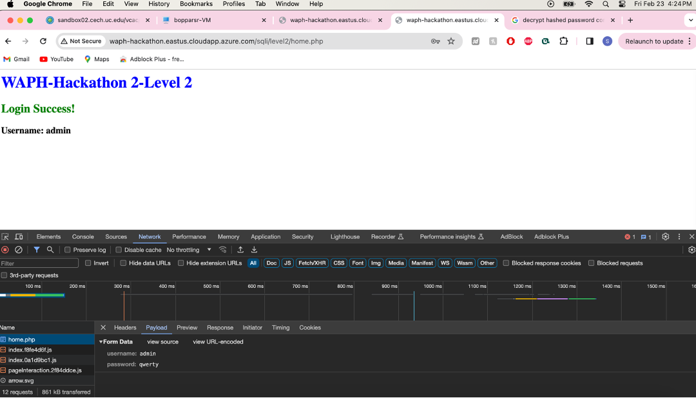

# WAPH-Web Application Programming and Hacking

## Instructor: Dr. Phu Phung

## Student

### Name: Sruthi Sridhar Bopparthi
### Email: bopparsr@mail.uc.edu


## Repository Information
### Repository's URL: [https://github.com/SruthiAelay/waph-bopparsr.git](https://github.com/SruthiAelay/waph-bopparsr.git)
### This is a private repository which is used to store all the codes related to course Topics in Computer Systems. The structure of this repository is as mentioned below.

# Hackathon 2 - SQL Injection Attacks

## Lab's overview
The hackathon is designed to provide participants with practical insights into SQL Injection Attacks (SQLi), a prevalent and critical security vulnerability in web applications. The learning experience is divided into three levels, each offering a progression of challenges and knowledge acquisition. Participants, through hands-on activities, actively identify and exploit vulnerabilities within a virtual web application environment. A key focus is on bypassing login checks, which allows us to understand how SQL injections can manipulate authentication processes. As we advance, the ultimate goal is to gain unauthorized access to the system, mirroring real-world scenarios where SQLi attacks can lead to unauthorized data retrieval. 

Link to Hackathon2 code : [https://github.com/SruthiAelay/waph-bopparsr/tree/main/Hackathon/Hacakthon2]([https://github.com/SruthiAelay/waph-bopparsr/tree/main/Hackathon/Hacakthon2])

## Level 0

URL : [http://waph-hackathon.eastus.cloudapp.azure.com/sqli/level0](http://waph-hackathon.eastus.cloudapp.azure.com/sqli/level0)

In Level 0, I employed single quotes after entering my username to effectively terminate the input within the SQL statement. Following this, I inserted 1=1 to ensure the SQL statement always evaluates to TRUE. Lastly, I appended ```;``` and ```#``` to signify the conclusion of the SQL statement and to comment out the remaining part of the statement.

SQL Injection Code:
```
bopparsr' OR 1 = 1 ; #
```


## Level 1

URL : [http://waph-hackathon.eastus.cloudapp.azure.com/sqli/level1](http://waph-hackathon.eastus.cloudapp.azure.com/sqli/level1)

At Level 1, I utilized double quotes to properly terminate the input within the SQL statement. Additionally, I included the same OR condition from Level 0 to ensure the statement evaluates to TRUE. I concluded by adding a semicolon (;) followed by a hash symbol (#) to signify the termination of the SQL statement and to comment out the remaining part of the statement. Moreover, I introduced an additional condition, "LIMIT 1", to ensure that the query satisfies the condition(if there is any) of returning a single record.

SQL Injection Code:
```
bopparsr' OR 1=1 LIMIT 1; #
```

Possible Code:
```
$sqlquery = "SELECT * FROM user WHERE user = "$user" AND pass=md5("$pass")";
$res = $mysqli -> query($sqlquery)
if ($res -> num_rows <= 1):
    return TRUE;
else:
    return FALSE;
```


## Level 2

URL : [http://waph-hackathon.eastus.cloudapp.azure.com/sqli/level2](http://waph-hackathon.eastus.cloudapp.azure.com/sqli/level2)

### a) Detecting SQLi Vulnerabilities

While checking for weakness in the code, I looked at the login webpages and tried different things on the products URL page. I saw that the result wasn't always the same, especially when using an ID like 'bopparsr,' which caused a big error. When I put data in double quotes, the response was empty. These inconsistencies suggest a problem with how the website handles input, making it susceptible to SQL injection in that specific part. The screenshot below shows my tests and the different results based on the input I used.

SQL Injection Code :
```
id=boppars
```


    
### b) Exploiting SQLi to Access Data

1) Identify the Number of Columns

- Craft SQL injection queries with UNION SELECT to infer the number of columns in the target database table.
- Adjust the queries iteratively, trying different numbers of columns until a successful UNION SELECT statement is found.
- Initially tried with 1 column, when error occurred.

SQL Injection Code:
```
id = 1 union select 1
```


- Further, I tried with 3 columns, when I successfully found out that there are three columns.

```
id - 1 union select 3,'bopparsr',01
```


2) Display Your Information

- SQL injection query that includes a UNION SELECT statement to display my information.
- Injected the crafted query into input fields where SQL injection is possible, such as URL.

```
id = 3 union select "bopparsr',"Sruthi Sridhar Bopparthi","WAPH"
```


3) Display the Database Schema

- Used advanced SQL injection techniques to exploit vulnerabilities and gain unauthorized access.
- Formulating SQL queries that fetch the database schema, including its tables data and columns data.

```
id: 1 UNION SELECT "bopparsr", table_name, column_name FROM information_schema.columns
```


4) Display Login Credentials

- Found out the table name which contains login credentials.
- Identified respective columns
  


- Decrypted hashed password of admin by using - https://hashes.com/en/decrypt/hash


### c) Login with Stolen Credentials

- Take the obtained login credentials and attempt to log in to the system.
- Successfully logging in demonstrates the effectiveness of SQL injection in achieving unauthorized access.


