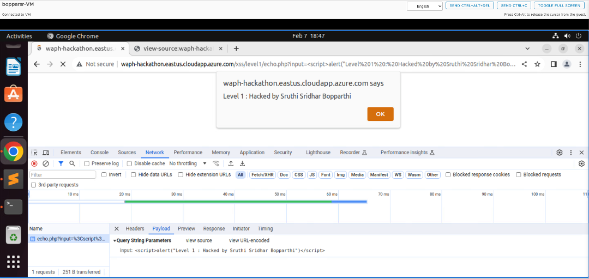
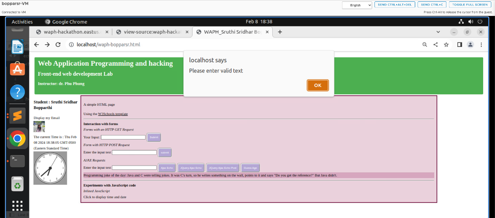

# WAPH-Web Application Programming and Hacking

## Instructor: Dr. Phu Phung

## Student

### Name: Sruthi Sridhar Bopparthi
### Email: bopparsr@mail.uc.edu


## Repository Information
### Repository's URL: [https://github.com/SruthiAelay/waph-bopparsr.git](https://github.com/SruthiAelay/waph-bopparsr.git)
### This is a private repository which is used to store all the codes related to course Topics in Computer Systems. The structure of this repository is as mentioned below.

# Hackathon 1 - Cross-site Scripting Attacks and Defences

## Lab's overview

In hackathon activity, we will delve into the intriguing world of reflected cross-site scripting (XSS) attacks, gaining practical experience and insights into web application vulnerabilities. The challenge unfolds across seven levels, each presenting an opportunity to showcase the skills by injecting code to display my name using the alert() function. The increasing difficulty from Level 0 to Level 6, coupled with point assignments, promises a dynamic learning curve. To succeed, we will not only demonstrate my proficiency in executing XSS attacks but also analyze and decipher the source code of the web application, honing my understanding of crucial web security principles. This hands-on exploration will significantly contribute to expertise in ethical hacking, security assessment, and responsible disclosure practices.

Link to Lab2 code : [https://github.com/SruthiAelay/waph-bopparsr/tree/main/Hackathons/Hackathon1]([https://github.com/SruthiAelay/waph-bopparsr/tree/main/Hackathons/Hackathon1])

## Task 1: Attacks

### Level 0

URL : [http://waph-hackathon.eastus.cloudapp.azure.com/xss/level0/echo.php](http://waph-hackathon.eastus.cloudapp.azure.com/xss/level0/echo.php)
Script to attack:
```
<script>alert('Level 0 - Hacked by Sruthi Sridhar Bopparthi')</script>
```


### Level 1

URL : [http://waph-hackathon.eastus.cloudapp.azure.com/xss//level1/echo.php](http://waph-hackathon.eastus.cloudapp.azure.com/xss/level1/echo.php)
Exploiting XSS vulnerabilities involves adding a malicious script to the end of the URL.

```
input=<script>alert('Level 1 - Hacked by Sruthi Sridhar Bopparthi')</script>
```



### Level 2

URL : [http://waph-hackathon.eastus.cloudapp.azure.com/xss/level2/echo.php](URL : http://waph-hackathon.eastus.cloudapp.azure.com/xss/level2/echo.php)

The request of HTTP does not engage with user inputs or path variables, this URL is linked to a HTML form. Using this form, we can directly inserting attacking script. This method enables the insertion of attacking code into the web application, allowing for the investigation of XSS vulnerabilities.

```
input=<script>alert('Level 2 - Hacked by Sruthi Sridhar Bopparthi')</script>
```
Possible Code:
```
	if(!isset($_POST['input']))
	{
		die("{\"error\": \"Please provide 'input' field in an HTTP POST Request\"}");
	}
	echo $_POST['input'];
```


### Level 3

URL : [http://waph-hackathon.eastus.cloudapp.azure.com/xss/level3/echo.php](URL : http://waph-hackathon.eastus.cloudapp.azure.com/xss/level3/echo.php)

Now, if `<script>` tag is sent through the variable of input directly, the web application filters it out. In order to get past this filter and properly attack the URL, the attacking code must be broken up into smaller pieces and then added together. This technique shows the perseverance and ingenuity needed in XSS attacks by allowing the injection of mallicious code that causes alert to appear on the particular webpage.

```
input=<scr<sc<script>ript>ipt>alert('Level 3 - Hacked by Sruthi Sridhar Bopparthi')</scr</sc</script>>>
```

Possible Code:
```
	$input = echo $_POST['input'];
	$input = str_replace(['<script>', '</script>'], '', $input)
```


### Level 4

URL : [http://waph-hackathon.eastus.cloudapp.azure.com/xss/level4/echo.php](URL : http://waph-hackathon.eastus.cloudapp.azure.com/xss/level4/echo.php)

I tried using the onload() event of `<body>` tag in order to run XSS script. Therfore, the `<script>` element is fully filtered, even though the script is broken or/and concatenated. The script sends out an alert when the page loads by embedding itself inside the onload() event. By evading the filter, harmful code can be injected without depending on the `<script>` tag.

```
input = <body onload="alert('Level 4 - Hacked by Sruthi Sridhar Bopparthi')">This website is hacked</body>
```

Possible Source code:
```
	$input = $_GET['input']
	if (preg_match('/<script\b[^>]*>(.*?)<\/script>/is', $input)) 
	{
		exit('{"error": "No \'script\' is allowed!"}');
	}
	else 
		echo($input);

```


### Level 5

URL : [http://waph-hackathon.eastus.cloudapp.azure.com/xss/level5/echo.php](URL : http://waph-hackathon.eastus.cloudapp.azure.com/xss/level5/echo.php)

Security measures have been further enhanced in level 5. I've used  `<body>` tag encoding onload() function to get around these limitations and still trigger a popup alert. By using this technique, one can circumvent the direct filters that are applied to `<script>` and alert() and execute JavaScript code indirectly. The utilization of Unicode encoding facilitates the representation of characters in a manner that the browser can comprehend as JavaScript code, hence permitting the attainment of the intended functionality.

```
input=<body onload="\u0061alert('Level 5 - Hacked by Sruthi Sridhar Bopparthi')">This website is hacked</body>
```

Possible Source Code:
```
	$input = $_GET['input']
	if (preg_match('/<script\b[^>]*>(.*?)<\/script>/is', $data) || stripos($data, 'alert') !== false) 
	{ 
		exit('{"error": "No \'script\' is allowed!"}');
	}
	else 
		echo($input);
```


### Level 6

URL : [http://waph-hackathon.eastus.cloudapp.azure.com/xss/level6/echo.php](URL : http://waph-hackathon.eastus.cloudapp.azure.com/xss/level6/echo.php)

In this case, htmlentities() method is used to translate characters into their corresponding HTML entities, which results in the input of user being shown on the webpage only as text. In this case, JavaScript event listeners are used to initiate an alert. In particular, the onclick() event listener is used, which causes the webpage to alert the user whenever any key is entered in user input. The method maintains the security precaution of displaying user input as plain text, but permits the execution of JavaScript code.

```

```

Possible Source code:
```
echo htmlentities($_REQUEST('input'));
```

 


## Task 2 : DEFENCE

### a. echo.php

Security against XSS attacks has been significantly improved in the updated echo.php file for Labs 1 and 2. Initially, the script verifies if the input is empty; if it is, PHP execution is stopped to stop additional processing. The input is cleaned using the htmlentities() function after it has been validated. By transforming potentially dangerous characters into their appropriate HTML entities, this function ensures that they are safe to see on the webpage. This reduces the possibility of XSS vulnerabilities and guarantees that the input is handled just as text.


### b. Front-end prototype

A comprehensive evaluation of the code in the waph-bopparsr.html file from Lab 2 led to extensive changes that improved security. External input locations in the code were carefully discovered during this process. To guarantee their integrity, each of these input points went through validation processes.

To further remove any possible security vulnerabilities, the output texts were cleaned. Together, these steps strengthen the codebase's security posture and reduce the possibility of vulnerabilities, especially those connected to XSS attacks.

1. validateInput() is added to improve the security of POST & GET requests. This function ensures the validity of the supplied data by requiring users to input text before executing the request. In addition, situations where plain text is displayed instead of HTML rendering when it is not necessary have been discovered in order to reduce the danger of XSS attacks. To check plain text and reduce the possibility of any attacking script execution, the innerHTML property has been replaced with.innerText. Together, these steps strengthen the web application's security protocols pertaining to input validation and output rendering.





2. EncodeInput() is a recently introduced function designed to prevent cross-site scripting (XSS) attacks. Through the transformation of special characters into the appropriate HTML entities, this function helps to sanitize the answer. By converting the content, the HTML document's content is effectively rendered as plain text, rendering it unexecutable and immune to malicious programs. Additionally, the code generates a new `<div>` element and appends the cleaned content (in innerText) to it. The function then returns the HTML content contained in this cleaned-up `<div>` element, guaranteeing improved security and guarding against potential XSS vulnerabilities.


3. The API calls now include extra validation checks for increased security and dependability. New checks have been added to make sure that the jokes that are fetched [https://v2.jokeapi.dev/joke/Programming?type=single](https://v2.jokeapi.dev/joke/Programming?type=single) are not empty in the JSON response, as well as the received result.joke property. An error message alerting the user is issued if either of these variables turns out to be null.


4. Similarly, additional validation steps have been added to the asynchronous function guessAge(). These include making sure the user-provided input is not null or empty and that the output obtained is neither empty nor zero. An appropriate error message alerts the user to the problem if either of these requirements is not met. By reducing the possibility of mistakes and guaranteeing the accuracy of incoming data as well as user input, these improvements strengthen the application's dependability and security.


