# WAPH-Web Application Programming and Hacking

## Instructor: Dr. Phu Phung

## Student

### Name: Sruthi Sridhar Bopparthi
### Email: bopparsr@mail.uc.edu


## Repository Information
### Repository's URL: [https://github.com/SruthiAelay/SruthiAelay.github.io/tree/main](https://github.com/SruthiAelay/SruthiAelay.github.io/tree/main)
### This is a private repository which is used to store all the codes related to course Topics in Computer Systems. The structure of this repository is as mentioned below.

# Project 2

## Project overview

This project aims to develop a secure, full-stack web application focused on a user management system using PHP and MySQL. It encompasses user registration, login, profile management, and password handling functionalities. The critical emphasis is on security, ensuring the integrity and confidentiality of user data through robust measures like password hashing and secure session management. This comprehensive exercise not only reinforces PHP and MySQL skills but also deepens understanding of web application security principles.

 Link to Project code : [https://github.com/SruthiAelay/waph-bopparsr/tree/main/individual-project2](https://github.com/SruthiAelay/waph-bopparsr/tree/main/individual-project2)

 Demonstration Video Link: [Video Link](https://mailuc-my.sharepoint.com/:v:/g/personal/bopparsr_mail_uc_edu/EezyMOBWOyNJkUmAfAmcN5kBkT7oQA6y_MQyzy1hHpUgDw?e=7lh7fZ&nav=eyJyZWZlcnJhbEluZm8iOnsicmVmZXJyYWxBcHAiOiJTdHJlYW1XZWJBcHAiLCJyZWZlcnJhbFZpZXciOiJTaGFyZURpYWxvZy1MaW5rIiwicmVmZXJyYWxBcHBQbGF0Zm9ybSI6IldlYiIsInJlZmVycmFsTW9kZSI6InZpZXcifX0%3D)

## Functional Requirements

### 1) User Registration

Created is a user registration page where user data, including name, email, username, and password, is gathered via user input. On the client side, regular expressions are employed to verify the validity of user input, ensuring it meets specified criteria. Additionally, password matching is implemented to confirm the accuracy of the entered passwords. On the server side, user details undergo sanitization using the ```user_sanitize``` function to validate the data. Input length and pattern are also examined using ```strlen()``` and ```preg_match()``` functions. The regular expressions for email and password ensure adherence to prescribed formats, while the server-side validation enhances data integrity and security.

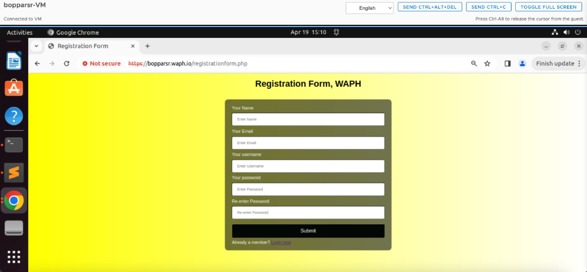

On Client side-
I have added pattern matching in HTML form as well as javascript where in I have form validations which will occur on onsubmit().
Regular Expression for Email
```/^[^\s@]+@[^\s@]+\.[^\s@]+$/```

Regular Expression for Password
```/^(?=.*[0-9])(?=.*[!@#$%^&*])[a-zA-Z0-9!@#$%^&*]{8,16}$/```

On server side-
Displays error messages with the invalid input highlighted if the input fails to meet length requirements or regex patterns. This setup ensures both frontend and backend validations are in place, minimizing the possibility of incorrect or malicious data being processed or stored.
```function sanitize_input($input)
	{
		$input=trim($input);
		$input=stripslashes($input);
		$input=htmlspecialchars($input);
		return $input;
	}
	if(strlen($username) < 1 || strlen($password) < 8 || strlen($email)< 3 || strlen($name)<1)
		{
			?>
            <div class="title">
            Invalid Length for username : <?php echo htmlentities($username);?>!
             </div>
            <?php
		}
		//Reg exp check
		else if (!preg_match("/\w+/", $username))  
		{
			?>
            <div class="title">
            Invalid pattern matching for username input <?php echo htmlentities($username);?>
             </div>
            <?php
		}
		else if (!preg_match("/\w+/", $name)) 
		{
			?>
            <div class="title">
            Invalid pattern matching for name input <?php echo htmlentities($username);?>!
             </div>
            <?php
		}
		else if(!preg_match('/^(?=.*[0-9])(?=.*[!@#$%^&*])[a-zA-Z0-9!@#$%^&*]{8,16}$/',$password))
		{
			
			?>
            <div class="title">
            Invalid pattern matching for password input <?php echo htmlentities($username);?>!
             </div>
            <?php

		}
		else if(!preg_match('/^[^\s@]+@[^\s@]+\.[^\s@]+$/', $email ))
		{
			?>
            <div class="title">
            Invalid pattern matching for email input <?php echo htmlentities($username);?>!
             </div>
            <?php
	}
```


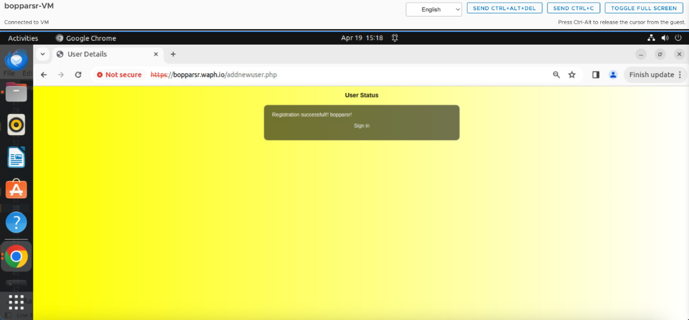

### 2) Login Form

I've created a simple login form that captures user credentials like username and password. When users submit the form, the system checks these credentials against a database to ensure they're correct. This ensures that only authenticated users can access the secure areas of my application, enhancing its security and providing a smoother user experience.

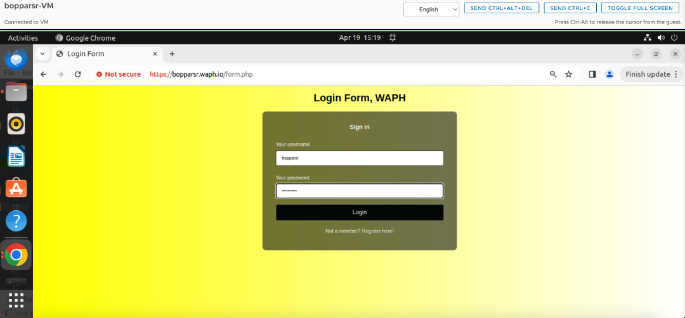

I've configured session parameters to last for 16 minutes and set secure attributes for my web application. When users access my site, sessions are initiated. If a user hasn't logged in or if their authentication status isn't marked as true, their session is terminated, and they're prompted to log in again. Additionally, if the user's browser doesn't match the browser recorded in the session data, which could indicate a session hijacking attempt, their session is terminated for security reasons. This script helps ensure that only authenticated users with secure sessions can access my application, enhancing its security against unauthorized access and potential attacks.

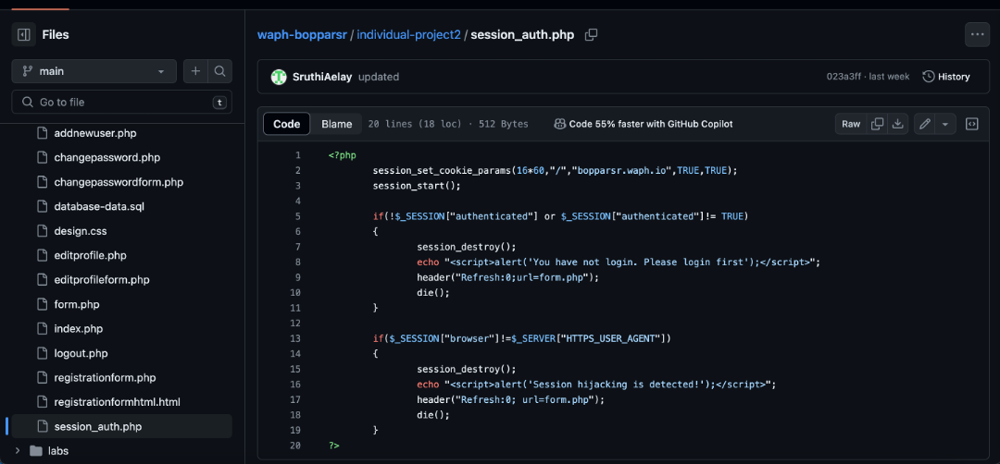


### 3) Profile Management

The "Edit Profile" form is a vital feature of my web application, enabling users to update their profile details conveniently. Structured in HTML, the form presents a user-friendly interface, featuring headings and input fields for new name and email. It's styled for visual appeal through a linked CSS file. At the form's outset, a PHP script named session_auth.php is included. This script handles authentication and session management, ensuring that only authenticated users can access the form. Upon form submission, the PHP script processes the data, retrieving the new name and email from the $_REQUEST superglobal array. Crucially, it employs CSRF protection by checking for a token submitted with the form, guarding against malicious exploitation. If the token is absent or incorrect, the script halts execution and alerts the user. Following validation, the script interacts with the database using MySQLi, executing an SQL UPDATE statement to modify the name and email fields in the users table for the logged-in user. Finally, the script provides user feedback, indicating whether the profile update was successful or not, and offers a logout link for secure session termination. This comprehensive approach ensures both user convenience and robust security in profile management.

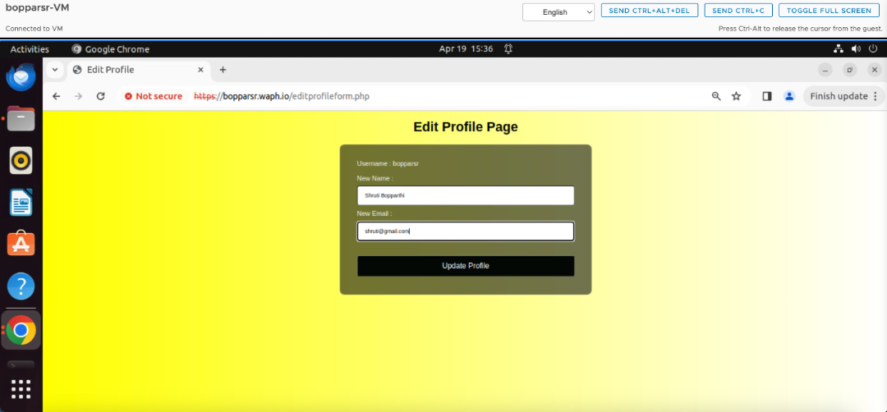

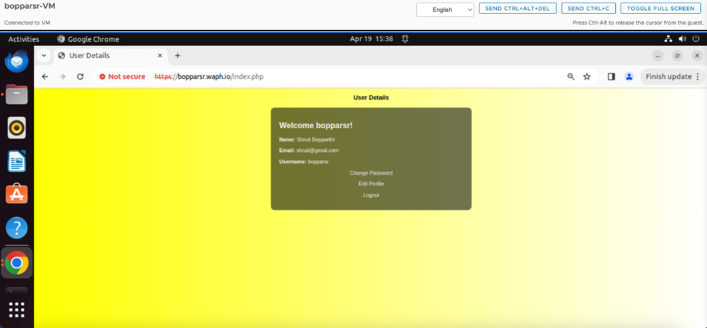

### 4) Password Update

In my web application's profile management system, I've implemented a section for changing passwords, presented through an HTML form. This form, styled for consistency and visual appeal using a linked CSS file, is crucial for users to maintain account security. Before users can access the form, a PHP script named session_auth.php is required to handle authentication and session management, it checks for a CSRF token submitted with the form to safeguard against cross-site request forgery attacks. If the token is missing or incorrect, the script immediately terminates the process to prevent unauthorized access. Upon successful submission of both username and password, the script interacts with the database using MySQLi. It executes an SQL UPDATE statement to hash and update the password securely for the respective user. Feedback is provided to the user regarding the success or failure of the password change operation, along with a link to logout securely. This comprehensive approach ensures both user convenience and robust security in password management.

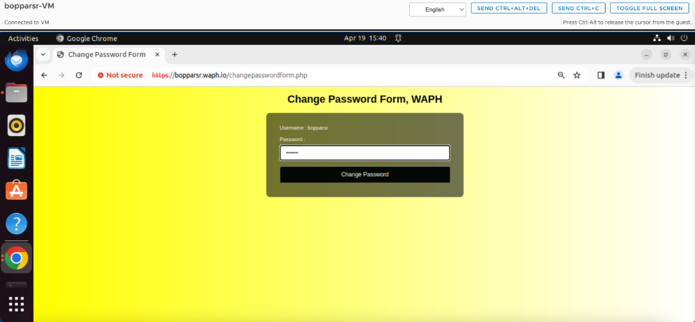

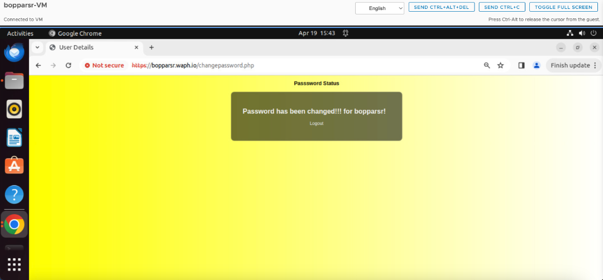

## Security and non-technical Requirements
 
### 1) Security

In my web application, I've implemented several crucial security measures to ensure the protection of user data and enhance overall system security. Firstly, the application is deployed over HTTPS, providing encryption and secure communication between the client and server, safeguarding sensitive information from interception or tampering during transmission.

Secondly, passwords are hashed before being stored in the database, ensuring that even if the database is compromised, passwords remain securely encrypted and cannot be easily decrypted. This hashing process adds an extra layer of security, protecting user credentials from unauthorized access.

Thirdly, to enhance database security, I've avoided using the MySQL root account in my PHP code. Instead, I've created a separate database user 'bopparsr' with privileges, adhering to the principle of least privilege to minimize the potential impact of a security breach.

Lastly, all SQL operations in the application utilize prepared statements to mitigate SQL injection attacks. Prepared statements separate SQL code from user input, preventing malicious SQL queries from being executed by treating user input as data rather than executable code. This approach significantly reduces the risk of SQL injection vulnerabilities, ensuring the integrity and security of the application's database interactions.

By implementing these security measures, my web application prioritizes the protection of user data and mitigates potential security risks, providing users with a safe and secure online experience.

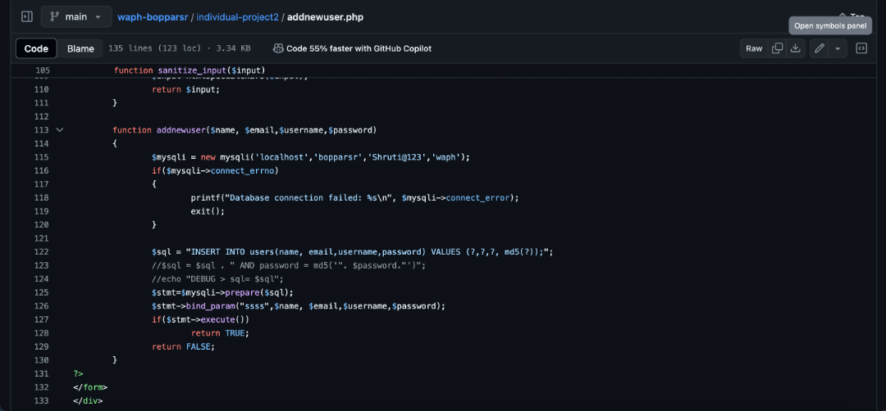

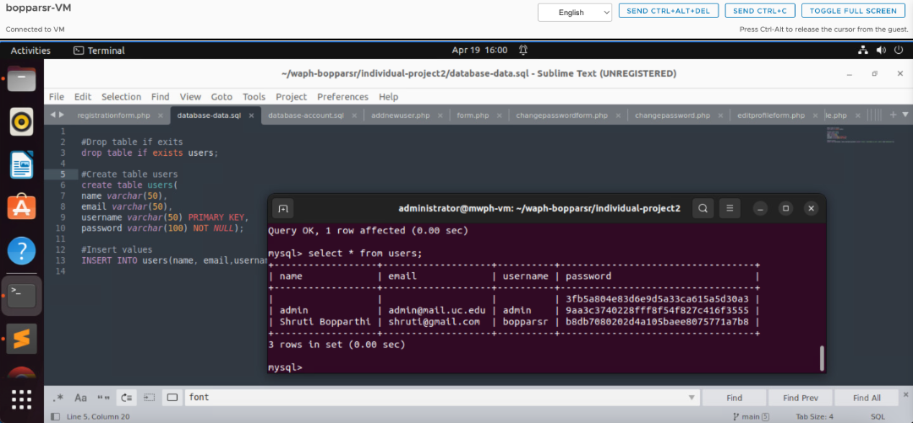

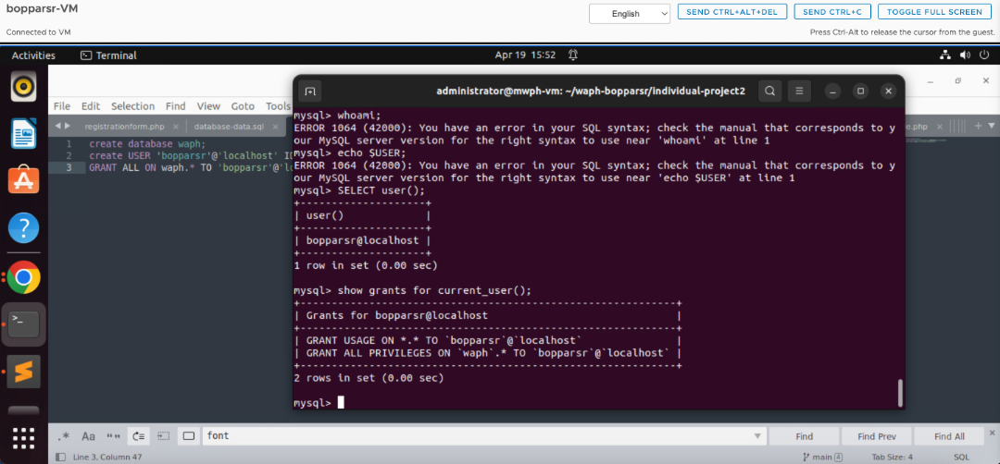

### 2) Input Validation

To ensure robust protection against common web vulnerabilities like XSS (Cross-Site Scripting) attacks, I've implemented comprehensive input validation measures on both the client and server sides. On the client side, I utilize HTML input attributes such as required, pattern, and maxlength to enforce basic validation rules directly within the browser. Additionally, I've integrated custom JavaScript validation to ensure that input fields meet specific criteria, including minimum length, format, and character restrictions. Furthermore, I prioritize sanitizing user input before rendering it on the client side to mitigate XSS risks.

On the server side, I conduct thorough validation of all user input to uphold data integrity and security. Employing techniques such as regular expressions and built-in validation functions, I verify input against expected formats and lengths. Moreover, I enforce the use of parameterized queries or prepared statements for database interactions, effectively thwarting SQL injection attacks. Output encoding is also employed to sanitize user-generated content before rendering, thereby mitigating XSS vulnerabilities.

### 2) Input Validation

In designing and implementing a MySQL database to securely store user information, several key considerations are paramount to ensuring data integrity and protection against potential security threats. The database schema should be meticulously planned, with tables structured to house user data, and any additional necessary information. Each table should have well-defined columns, with appropriate data types, constraints, and relationships established to maintain data integrity. Secondly, secure practices must be implemented throughout database interactions. 

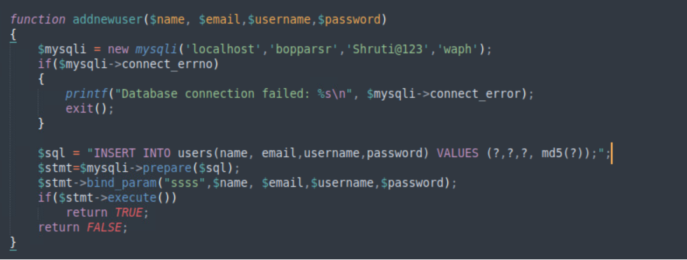

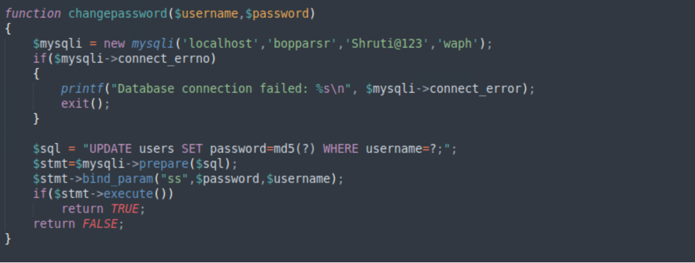

### 3) Front-end development

To craft an intuitive and responsive user interface, I first outline the HTML structure, employing semantic elements for clarity and organization. This includes headers for page titles, navigation bars for easy access to different sections, and forms for user interaction. In parallel, I employ CSS to stylize the interface, defining typography, colors, layout, and responsiveness for optimal display across various devices. Furthermore, I integrate client-side validation using HTML5 attributes and JavaScript to enhance user experience and prevent erroneous inputs. This validation occurs in real-time, providing immediate feedback to users and guiding them towards correct form submission. By harmonizing HTML, CSS, and JavaScript, I create a seamless and engaging user experience that balances aesthetics with functionality while adhering to modern web standards.

### 4) Session Management

To guard against session-hijacking and fixation attacks, session management measures have been implemented. These include verifying user authentication for every HTTP request, monitoring the total active time of each session, configuring session parameters securely, and validating the web browser client to mitigate session hijacking attempts. Through these methods, the system ensures that only authenticated users with valid sessions can access protected resources. Additionally, regularly monitoring session activity helps detect any anomalies or suspicious behavior, allowing for swift intervention if unauthorized access is detected. Overall, these measures bolster the security of the session management system and protect against potential threats posed by session-hijacking and fixation attacks.

### 5) CSRF Protection

To fortify against Cross-Site Request Forgery (CSRF) attacks, mechanisms such as anti-CSRF tokens have been integrated, particularly in database modification scenarios. Anti-CSRF tokens are unique, randomly generated tokens embedded within forms or requests. Upon submission, the server validates these tokens to ensure that the request originated from the legitimate user and not from a malicious third-party site. In database modification use cases, such as updating user information or performing transactions, anti-CSRF tokens act as an additional layer of defense. By including these tokens in forms or requests for database modifications, the system ensures that only authenticated users who have interacted with the application can initiate such actions, mitigating the risk of CSRF attacks. This approach enhances the overall security posture of the application and safeguards against unauthorized modifications to the database by malicious actors.

