# WAPH-Web Application Programming and Hacking

## Instructor: Dr. Phu Phung

## Student

### Name: Sruthi Sridhar Bopparthi
### Email: bopparsr@mail.uc.edu


<p><h3> Figure 1: Sruthi Headshot</h3></p>

## Repository Information
### Repository's URL: https://github.com/SruthiAelay/waph-bopparsr.git
### This is a private repository which is used to store all the codes related to course Topics in Computer Systems. The structure of this repository is as mentioned below.

## The lab's overview

Part 1 is all about understanding how websites talk to each other. We'll use Wireshark, a detective tool for network traffic, to listen in on their conversations and learn about HTTP, the language they use. Telnet is like a megaphone, letting us directly send messages to servers and see their responses. By doing this, we'll discover the different parts of HTTP messages, what they mean, and how they make websites work.

In Part 2, we can start building our own websites! We'll use CGI, a trusty translator, to connect user input (like what you type in a form) to programs written in C. We'll also explore PHP, another way to build websites, and learn about GET and POST, two different ways to send information online. And because safety first, we'll discuss how to keep things secure when building websites.

By the end of this lab, we'll have a solid understanding of how websites work, how to build them yourself.

Link to Lab1 code : https://github.com/SruthiAelay/waph-bopparsr/tree/main/labs/lab1

## Part 1 - The Web and HTTP Protocol
### Task 1 - Familiar with the Wireshark tool and HTTP protocol

Wireshark is a network protocol analyzer that allows us to capture and inspect data traveling back and forth between a client and a server. The focus was on gaining familiarity with Wireshark for HTTP traffic analysis. The first step was to Capturing HTTP Traffic. Opened Wireshark and selected the network interface. Second step was to Analyzing HTTP Components. Applied a http filter to specifically cread HTTP traffic. Examined captured packets to understand the components of HTTP, including headers, methods, and status codes. Focused on HTTP Request and Response messages.

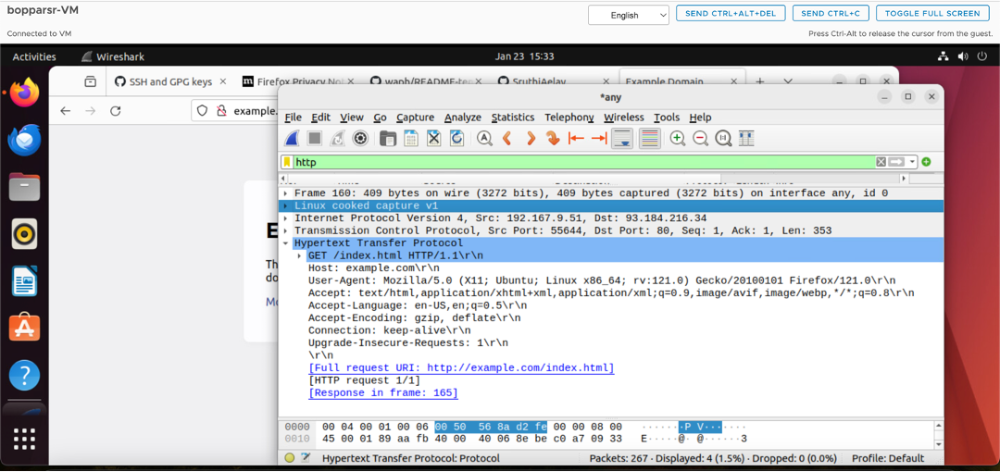

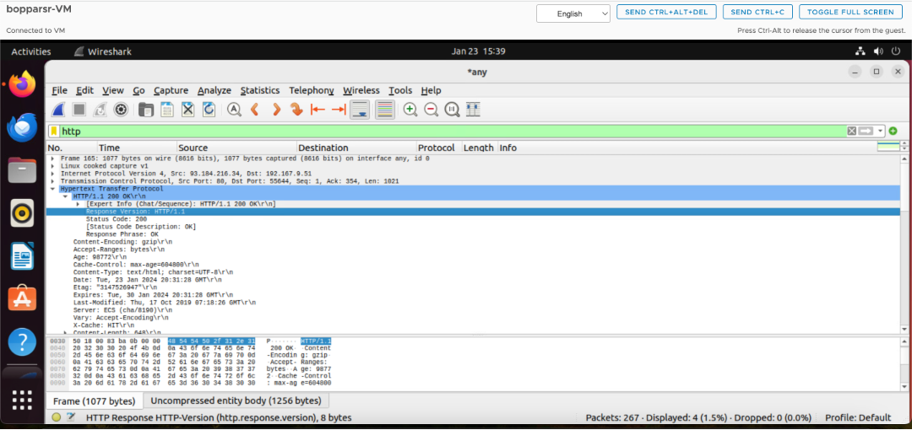

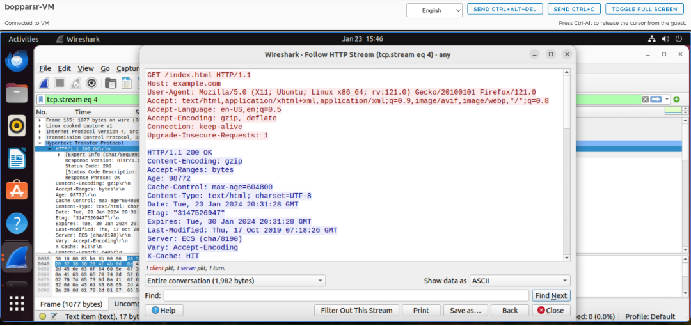

### Task 2 - Understanding HTTP using telnet and Wireshark

The telnet program was utilized to send a minimal HTTP Request, and Wireshark was employed to examine the resulting HTTP messages. Firstly, Opened a command prompt and initiated a telnet connection to the HTTP server.
Manually crafted a minimal HTTP Request by specifying the method, resource, and HTTP version establishing a connection to the target server on the port 80.Then sent the manually crafted HTTP Request to the server using telnet. Later, observed the server's response to the HTTP Request. By Opening Wireshark and selected the network interface for capturing. Applied http filter to specifically capture HTTP traffic.The examined captured packets to identify the telnet-induced HTTP traffic to observe HTTP request and response.

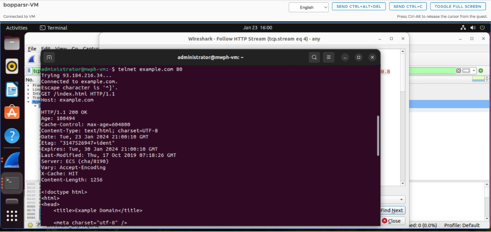

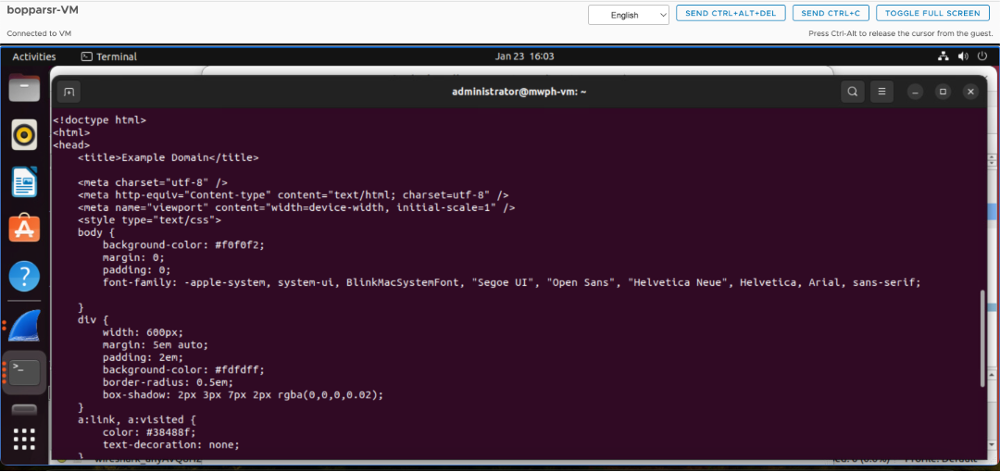

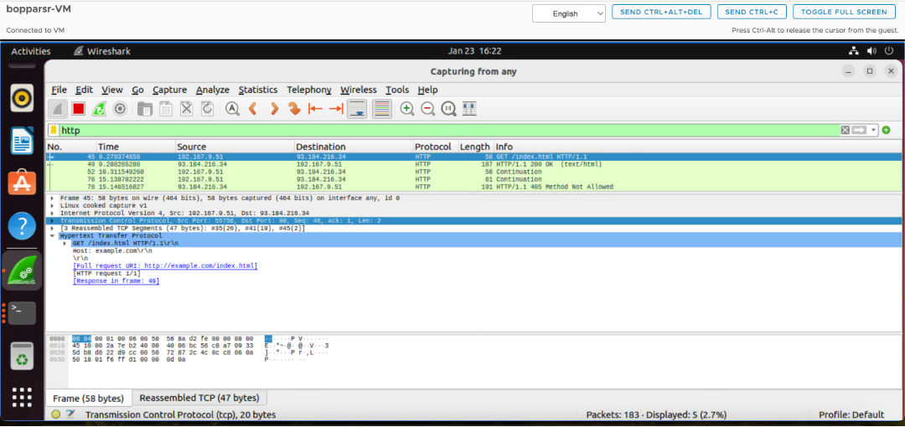

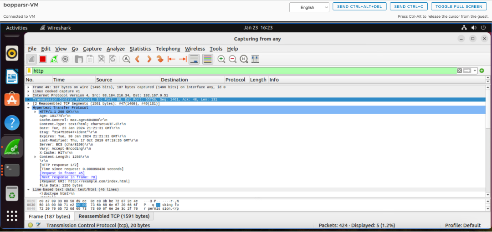

## Part II - Basic Web Application Programming
### Task 1 - CGI Web applications in C

1) Developing a Hello World CGI program in C involves a    straightforward process that includes the creation of a C source code file, compilation using a C compiler, and deployment on the web server. Firstly, developed a C source code file named helloworld.c with necessary CGI headers followed by the HTML content, e.g., "Hello, World!". Then, 
used a C compiler, such as GCC, to compile the source code. Later, generated an executable file named helloworld.cgi. Transfered the compiled CGI executable (helloworld.cgi) to the web server's CGI directory i.e /usr/lib/cgi-bin/
Configured CGI execution in the server's configuration.
Open a web browser and navigate to the appropriate URL.
Example URL: http://localhost/cgi-bin/helloworld.cgi
The web server will execute the CGI program, and the browser will display the generated output.

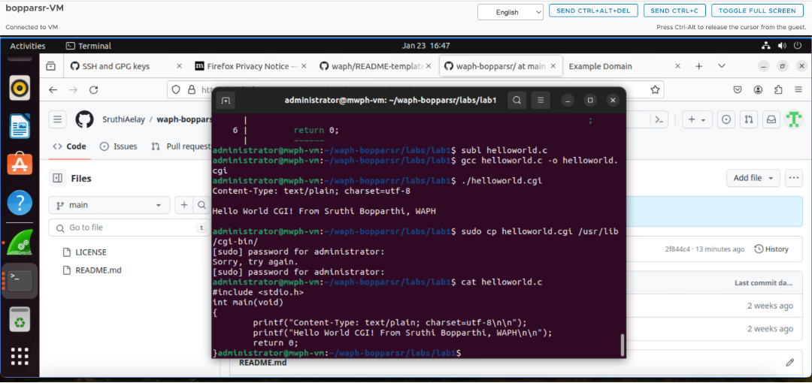

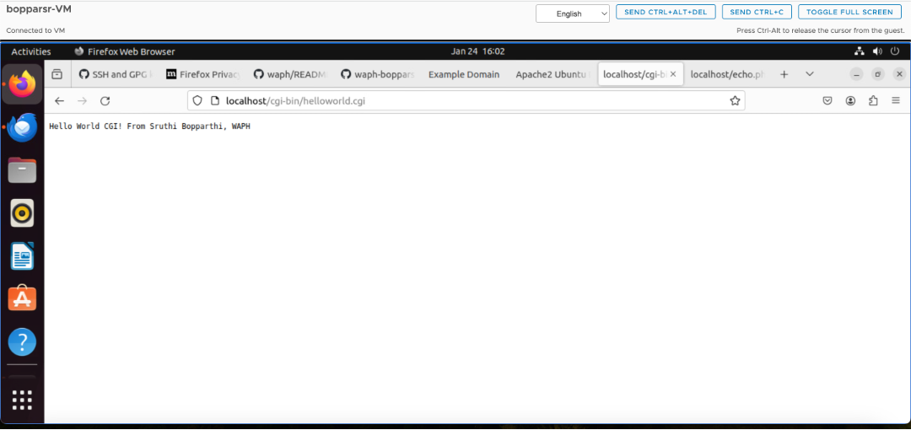

2) Summarize and demonstrate with a screenshot that you can write another C CGI program and deploy it with a simple HTML template provided on https://www.w3schools.com/html/Links to an external site. with proper title, heading, and paragraph, i.e., the course and your information should be there.

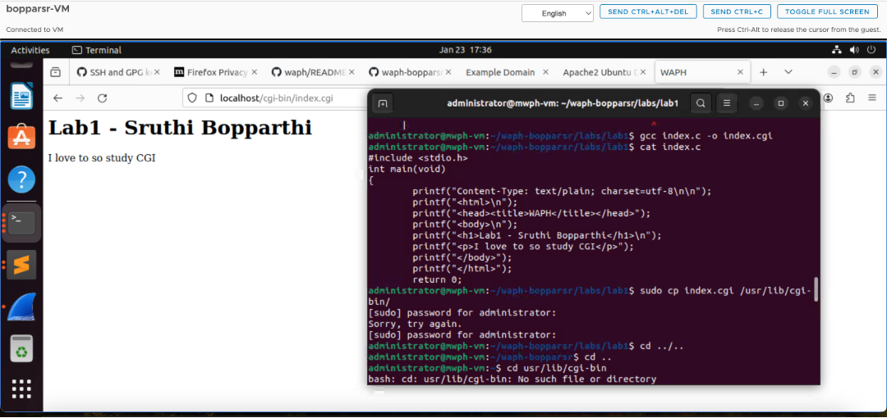

```c
	#include <stdio.h>
	int main(void){
		printf("Content-Type: text/html; charset=utf-8\n\n")
		printf("<html>\n");
		printf("<head><title>WAPH</title></head>");
		printf("<body>\n");
		printf("<h1>Lab1 - Sruthi Bopparthi</h1>\n");
		printf("<p>I love to so study CGI</p>");
		printf("</body>");
		printf("</html>");
		return 0;
	}
```

### Task 2 - A simple PHP Web Application with user input

1) I developed a simple helloworld.php script in PHP to demonstrate dynamic content generation. The script included the standard PHP opening and closing tags (<?php and ?>) and a single echo statement to output the "Hello, World!" message. After saving the PHP file, I moved it to a directory accessible by the web server. To test the script, I navigated to the appropriate URL in a web browser (e.g., http://localhost/helloworld.php). The server executed the PHP script, and the browser displayed the "Hello, World!" message. This process validated the successful development and deployment of a basic PHP script for dynamic content generation on the web server.

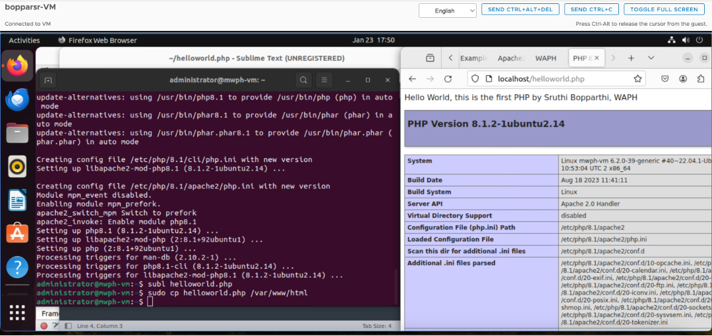

2) Demonstrate that you developed and deployed an echo Web application in PHP, e.g., echo.php

I developed and deployed an echo.php web application in PHP, which involves creating a PHP script to output user-submitted data. The script uses the $_GET superglobal to retrieve data from the URL parameters and then echoes that data back to the user. Below is the source code for the echo.php file:

```php
<?php
  echo $_REQUEST["data"];
?>
```

Regarding security risks, this simple web application has a potential security issue known as Cross-Site Scripting (XSS). If user input is not properly sanitized or validated, an attacker could inject malicious scripts into the application, compromising the security of users. To mitigate this risk, input validation and sanitation measures should be implemented, such as using functions like htmlspecialchars to ensure that user input is treated as plain text and not interpreted as code by the browser.

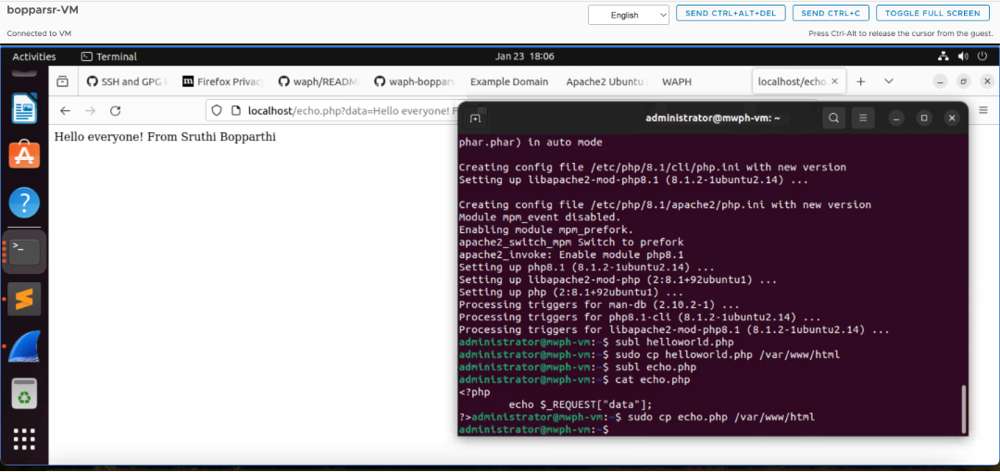

### Task 3 - Understanding HTTP GET and POST requests.
1) I used Wireshark to examine the HTTP GET Request and Response for the echo.php page with my name in the data. First, I initiated the HTTP GET Request by accessing the URL "http://localhost/echo.php?data=Hello%20everyone!%20From%20Sruthi%20Bopparthi" in a web browser. Meanwhile, Wireshark was capturing network traffic. In Wireshark, I applied a filter for HTTP traffic to focus on the relevant packets.

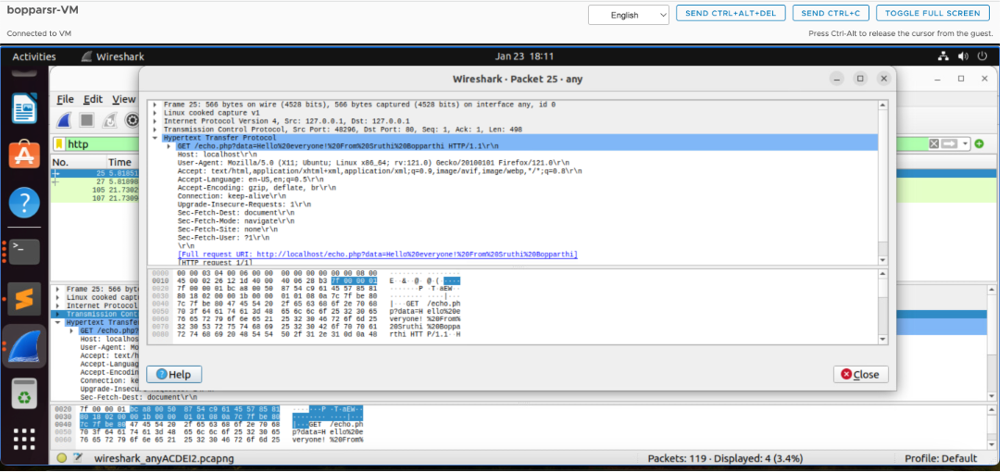

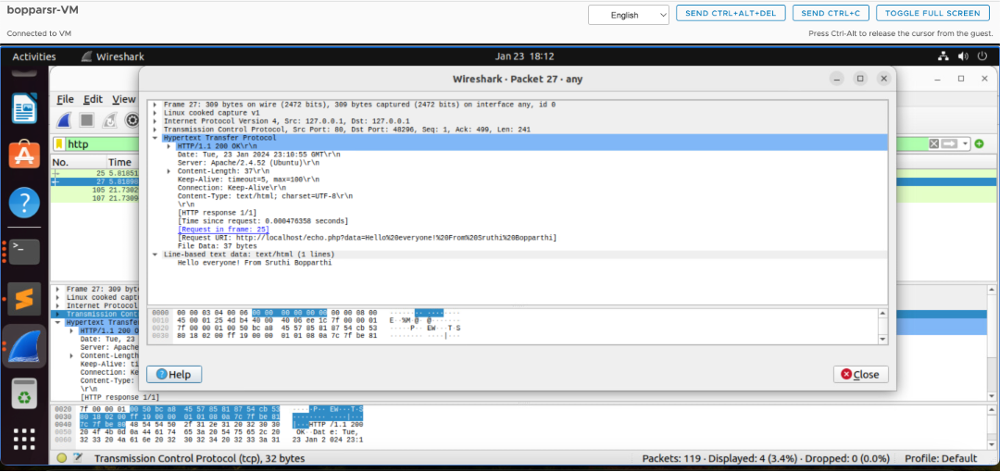

2) Curl - I used the curl command to create an HTTP POST request with my name in the data. The command syntax involved specifying the URL to which the POST request was directed, using the -d option to include data in the request, and providing the data in the form of key-value pairs.Command-
curl -X POST http://localhost/echo.php -d "data=Hello Everyone, From Sruthi Bopparthi"
This curl command simulated an HTTP POST request, allowing me to observe how the echo.php page handles POST data. The server processed the request and generated an appropriate HTTP Response, displaying the personalized greeting based on the provided name parameter.

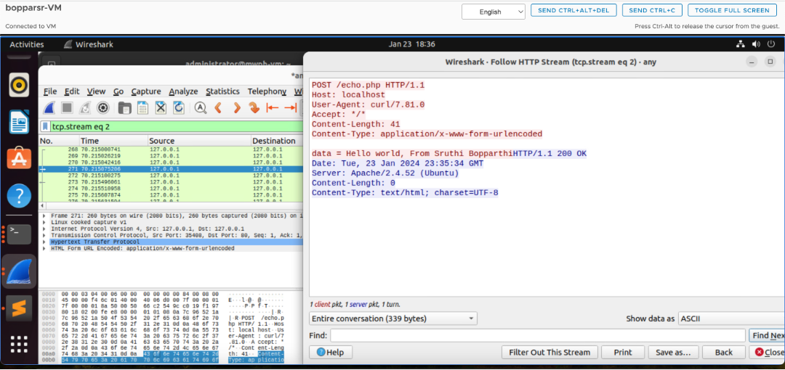

3) Compare the similarity/difference between HTTP POST Request and HTTP GET Request and between the two HTTP Responses above

HTTP GET and POST requests serve distinct purposes in web communication. An HTTP GET request is utilized to retrieve data from a specified resource. It appends data to the URL through query parameters, making it visible in the address bar. However, this visibility poses security concerns, and there are limitations on the amount of data that can be transferred due to URL length constraints. In contrast, an HTTP POST request is employed to submit data to be processed by a specified resource. The data is sent in the request body, ensuring a more secure method compared to GET requests. As a result, sensitive information is not exposed in the URL, and POST requests can handle larger amounts of data without the limitations imposed by URL length constraints. Both types of requests elicit responses from the server, with the data typically included in the message body. While HTTP GET responses can be cached by browsers, HTTP POST responses are usually not cached to prevent unintentional repeated submissions and maintain data integrity and security.

