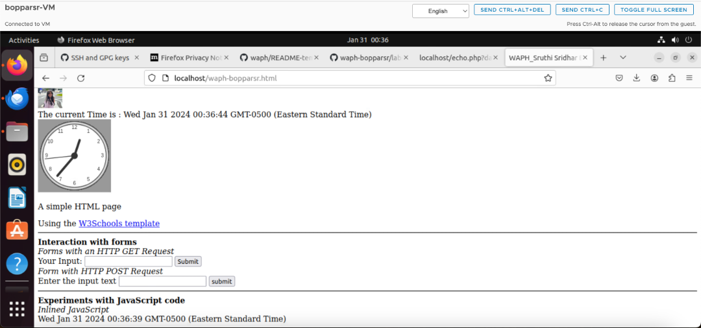

# WAPH-Web Application Programming and Hacking

## Instructor: Dr. Phu Phung

## Student

### Name: Sruthi Sridhar Bopparthi
### Email: bopparsr@mail.uc.edu


<p><h3> Figure 1: Sruthi Headshot</h3></p>

## Repository Information
### Repository's URL: [https://github.com/SruthiAelay/waph-bopparsr.git](https://github.com/SruthiAelay/waph-bopparsr.git)
### This is a private repository which is used to store all the codes related to course Topics in Computer Systems. The structure of this repository is as mentioned below.

## The lab's overview

This lab is a comprehensive set of hands-on exercises spanning Lectures 4-6, focusing on fundamental web development concepts. Task 1 revolves around creating a basic HTML file, incorporating tags, a headshot image, and a form. The JavaScript aspect involves writing code for inline functionality to display the current date/time and log key presses, creating a digital clock, implementing show/hide functionality for an email using both inline and external JavaScript, and displaying an analog clock using external JavaScript. 

Task 2 delves into more advanced topics such as Ajax, CSS, jQuery, and Web API integration. The Ajax section requires adding HTML code for user input and constructing an Ajax GET request to the echo.php web application, inspecting the network for a detailed understanding. The CSS component involves adding styles using inline, internal, and external CSS. The jQuery part includes incorporating the library and using it to send Ajax GET requests and display responses on button clicks. Lastly, the Web API integration task involves fetching and displaying a random programming joke using jQuery Ajax and inspecting network connections. Similarly, using the fetch API on another endpoint is included, requiring HTML and JavaScript code for user input and response display. The overall lab emphasizes practical application of web development concepts, ranging from basic HTML structure to advanced topics like Ajax and API integration.

By the end of this, we would be able to learn HTML tags, CSS, AJAX, JQuery and API calls.

Link to Lab2 code : [https://github.com/SruthiAelay/waph-bopparsr/tree/main/labs/lab2]([https://github.com/SruthiAelay/waph-bopparsr/tree/main/labs/lab2])

## Task 1: Basic HTML with forms, and JavaScript

### a. Develop a simple HTML file (named waph-yourusername.html) with basic tags, an image of your headshot, and a form.

To create my HTML file, "waph-bopparsr.html," I started with the basic HTML structure, including tags like `<!DOCTYPE html>`, `<html>`, `<head>`, and `<body>`. In the `<head>` section, I added meta tags for character set and viewport and set a title for my webpage. Inside the `<body>` section, I used heading tags to declare my name and my professor's name. I included an `` tag for my headshot and a `<form>` tag to handle form actions. 


### b. Simple JavaScript

In crafting my HTML page, I integrated diverse JavaScript functionalities to augment user interactivity. For inline JavaScript, I established an interactive environment wherein a click event dynamically reveals the current date and time, while simultaneously logging key presses in real-time. The inclusion of an internal JavaScript script within a `<script>` tag facilitated the creation of a dynamic digital clock, ensuring continuous updates based on the current time. To further enhance user engagement, I organized JavaScript code into an external file, establishing a show/hide mechanism for my email through the manipulation of HTML elements. Additionally, I implemented an analog clock using an external JavaScript code and HTML canvas element, allowing for an aesthetically pleasing representation of time with interactive clock hands that adapt dynamically to the ongoing time. This amalgamation of inline, internal, and external JavaScript code has resulted in a feature-rich HTML page, providing users with an array of interactive and visually appealing elements.




## Task 2: Ajax, CSS, jQuery, and Web API integration

### a. Ajax

I updated my HTML page by introducing a user input field, a button, and a `<div>` element. With JavaScript, I programmed the button to retrieve user input when clicked. Subsequently, I implemented an Ajax GET request, leveraging the echo.php web application from a previous lab. This request is designed to send the user input to the server. To complete the interaction, I set up an event listener to capture the HTTP response and display its content in the response element on my webpage. 


### b. CSS 

I enhanced my webpage's visual appeal by incorporating CSS through various methods. Using inline CSS, I directly applied styles to specific elements within the HTML, tailoring their appearance individually. I applied inline CSS to Analog clock to set background color. In the `<head>` section of my HTML, I employed internal CSS using the `<style>` tag to define broader styling rules that apply to multiple elements. This allowed for consistent formatting across the page. I applied this for the button and setting the backgrounf colors for heading, adding borders, border color to User input and requests. For a more organized approach, I created an external CSS file (e.g., styles.css) and linked it to my HTML using the '<link>' tag. This external stylesheet centralized my styling instructions, promoting maintainability. Additionally, I utilized a remote CSS file, accessed through a provided link, to leverage pre-existing styles and further streamline the design process. 


### c. jQuery

#### 1) When the corresponding button is clicked, send an Ajax GET request to the echo.php web application and display the response content

I implemented a dynamic feature on my webpage by programming a button to trigger an Ajax GET request when clicked. Using JavaScript, I crafted the code to communicate with the echo.php web application, initiating a request to fetch data. Upon receiving the response from the server, I integrated functionality to display the content dynamically on the webpage. This interactive element not only enhances user engagement but also facilitates real-time communication with the server, allowing for the seamless retrieval and display of data on my webpage.


#### 2) Similarly, when the corresponding button is clicked, send an Ajax GET request to the echo.php web application and display the response content

I recently enhanced my webpage by incorporating a feature that responds to user interaction. Upon clicking a designated button, my JavaScript code triggers an Ajax POST request directed towards the echo.php web application. This request is designed to send data to the server for processing. Subsequently, upon receiving the response from the server, I've implemented code to dynamically display the content on the webpage. 


### d. Web API integration

#### 1) Using Ajax on https://v2.jokeapi.dev/joke/Programming?type=single

I implemented a captivating feature on my webpage using jQuery Ajax. Upon loading the page, my JavaScript code orchestrates an Ajax request to the https://v2.jokeapi.dev API, specifically targeting programming-related single-line jokes. The code is designed to handle the response effectively, ensuring a seamless integration of a random joke onto the webpage. To inspect the intricacies of this process, I utilized the browser's network tools to examine the request and response details, providing me with valuable insights into the data exchange between my webpage and the external API. This not only enriches the user experience with humorous content but also showcases my proficiency in utilizing Ajax for dynamic data retrieval and presentation.


#### 2) Using the fetch API on https://api.agify.io/?name=inputLinks to an external site.

I utilized the fetch API to interact with the https://api.agify.io/ endpoint, where user input dictates the name for analysis. Through a combination of HTML and JavaScript, I crafted code that employs the fetch() method to initiate a call to this external API, incorporating user-supplied input. The results of this request are then dynamically showcased on the webpage. In the process, I delved into the intricacies by using the browser's network inspection tools to examine the specifics of both the outgoing request to the API and the subsequent response. However, during this API interaction, I encountered a challenge as I did not receive a response. This issue arose due to the agify API reaching its daily limit, resulting in an error (429: Request Limit Reached).


Code-

```
<!DOCTYPE html>
<html>
<head>
	<link rel="stylesheet" type="text/css" href="https://waph-uc.github.io/style1.css">
	<style>
		.button
		{
			background-color:#b4a7d6;
			border:groove;
			color:white;
			padding:10px;
			text-align:center;
			text-decoration:none;
			display:inline-block;
			font-size:12px;
			margin:4px2px;
			cursor:pointer;
		}
		.round
		{
			border-radius:8px;
		}
		#response
		{
			background-color:#d5a6bd;
		}
		#main
		{
			border-style: solid;
			border-color: #741b47;
			border-width: 3px;
			background-color: #ead1dc;
		}
	</style>
	<meta charset="utf-8">
	<title>WAPH_Sruthi Sridhar Bopparthi</title>
</head>
<body>
	<div class="container wrapper">
	<div id='top'>
		<h1> Web Application Programming and hacking</h1>
		<h2>Front-end web development Lab</h2>
		<h3>Instructor: dr. Phu Phung</h3>
	</div>
	<div class="wrapper">
	<div id="menubar">
			<h3>Student : Sruthi Sridhar Bopparthi</h3>
			<div id="email" onclick="showOrHideEmail()">Display my Email</div>
			<script type="text/javascript" src="email.js"></script>
			
			<div id="digital-clock"></div>
			<canvas id="analog-clock" width="150" height="150" style="background-color:#999;"></canvas>
			<script src="https://waph-uc.github.io/clock.js"></script>
		</div>
	<div id="main">
		<p> A simple HTML page </p>
		Using the <a href="https://www.w3schools.com/html"> W3Schools template</a>
		<hr>
		<b>Interaction with forms</b>
		<div>
			<i>Forms with an HTTP GET Request</i>
			<form action="/echo.php" method="GET">
				Your Input: <input name="data">
				<input class="button round" type="submit" value="Submit">
			</form>
		</div>
		<div>
				<i>Form with HTTP POST Request</i>
				<form action="/echo.php" method="POST">
				<lable for="data">Enter the input text</lable>
				<input type="text" name="data" onkeyup="console.log('you have clicked a Key')">
				<input class="button round" type="submit" value="submit">
				</form>
			</div>
			<div>
				<i>AJAX Requests</i><br>
				<lable for="data">Enter the input text</lable>
				<input type="text" name="data" id="data">
				<input class="button round" type="submit" value="Ajax Echo" onclick="getEcho()">
				<input class="button round" type="submit" value="JQuery Ajax Echo" onclick="getJqueryAjax()">
				<input class="button round" type="submit" value="JQuery Ajax Echo Post" onclick="getJqueryAjaxPost()">
				<input class="button round" type="submit" value="Guess Age" onclick="guessAge($('#data').val())">
				<div id="response"></div>
			</div>
			<hr>
				<div>
				<b>Experiments with JavaScript code</b><br>
				<i>Inlined JavaScript</i>
				<div id="inlineDate" onClick="document.getElementById('inlineDate').innerHTML=Date()">Click to dsplay time and date</div>
				</div>
	</div>
</div>
</div>
	<script src="https://code.jquery.com/jquery-3.7.1.min.js" 
		integrity="sha256-/JqT3SQfawRcv/BIHPThkBvs0OEvtFFmqPF/lYI/Cxo="
		crossorigin="anonymous"></script>
	<script>
		function displayTime() {
			document.getElementById('digital-clock').innerHTML=" The current Time is : "+ Date();
		}
		setInterval(displayTime,500);
	</script>
	<script type=text/javascript>
			var canvas=document.getElementById("analog-clock");
			var ctx=canvas.getContext("2d");
			var radius = canvas.height/2;
			ctx.translate(radius,radius);
			radius=radius*0.90;
			setInterval(drawClock,1000);
			function drawClock(){
				drawFace(ctx,radius);
				drawNumbers(ctx,radius);
				drawTime(ctx,radius);
				}
			function getEcho(){
			var input = document.getElementById("data").value;
			if(input.length==0){
			return ;
			}
			var xhttp = new XMLHttpRequest();
			xhttp.onreadystatechange = function(){
		//alert("readyState "+ this.readyState +", status "+this.status+", statusText= "+this.statusText);
			if(this.readyState==4 && this.status==200){
				console.log("Received data= "+xhttp.responseText);
				document.getElementById("response").innerHTML= xhttp.responseText;
			}
			}
			xhttp.open("GET", "echo.php?data="+input, true);
			xhttp.send();
			document.getElementById("data").value="";
			}
			function getJqueryAjax(){
				var input=$("#data").val();
				if(input.length==0)
					return;
				$.get("/echo.php?data="+input,
				      function(result){
					      printResult(result);
						});
				$("#data").val("");
			}
			function getJqueryAjaxPost(){
				var input=$("#data").val();
				if(input.length==0)
					return;
				$.post("/echo.php",{data:input},function(result){
					printResult(result);
					});
				$("#data").val("");
			}
			function printResult(result){
			$("#response").html(result);
			}
			$.get("https://v2.jokeapi.dev/joke/Programming?type=single",function(result){
				$("#response").html("Programming joke of the day: " +result.joke);
				});
			async function guessAge(name){
				const response= await fetch("https://api.agify.io/?name="+name);
				const result= await response.json();
				$("#response").html("Hello "+name+" ,your age should be "+result.age);
			}
	</script>
</body>
</html>
```
