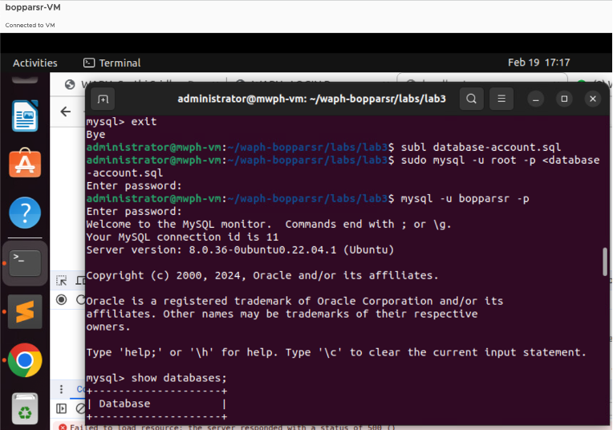
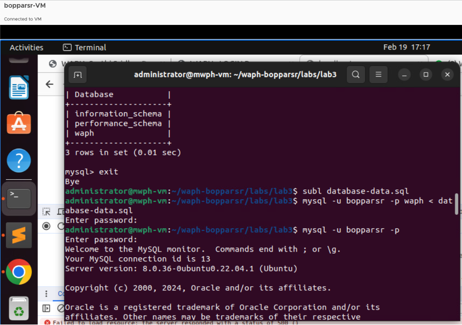
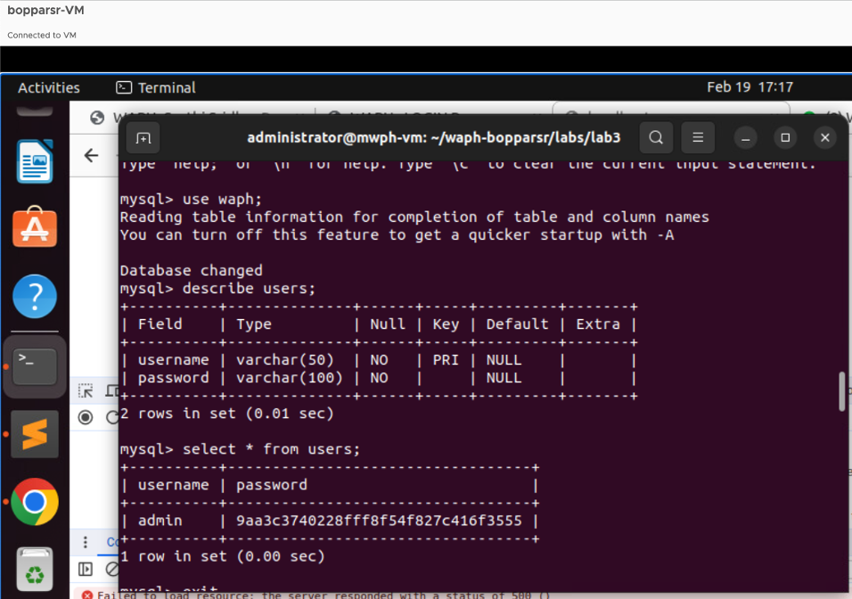
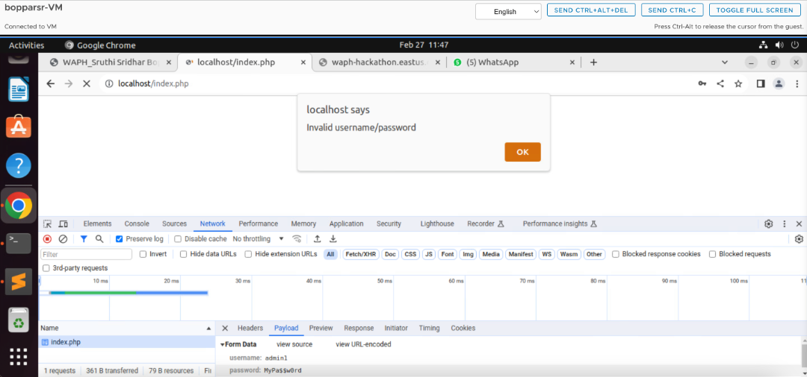
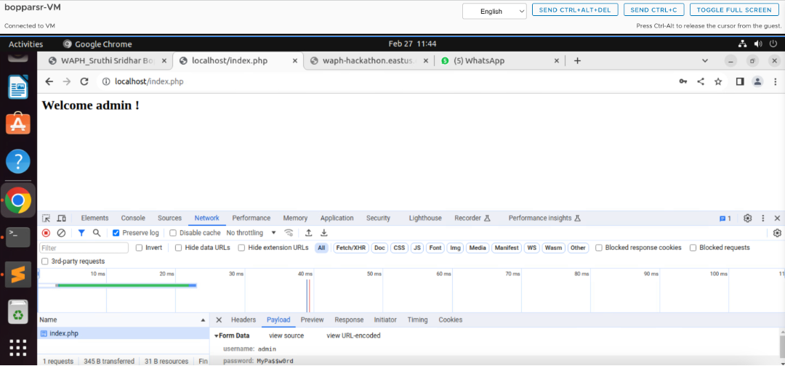
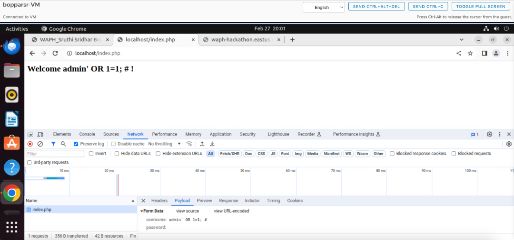
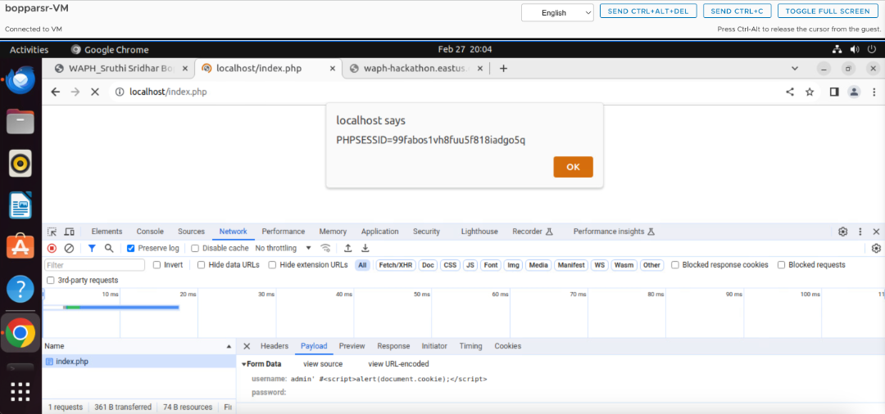
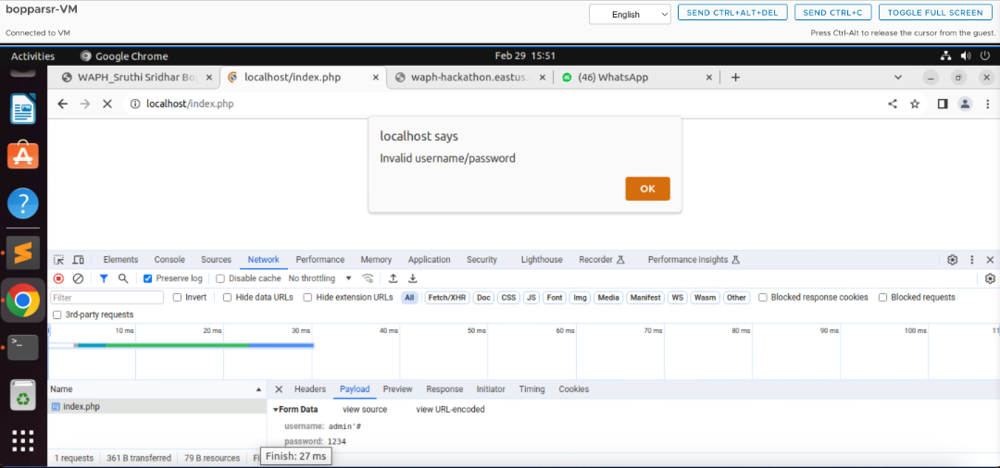

# WAPH-Web Application Programming and Hacking

## Instructor: Dr. Phu Phung

## Student

### Name: Sruthi Sridhar Bopparthi
### Email: bopparsr@mail.uc.edu


## Repository Information
### Repository's URL: [https://github.com/SruthiAelay/waph-bopparsr.git](https://github.com/SruthiAelay/waph-bopparsr.git)
### This is a private repository which is used to store all the codes related to course Topics in Computer Systems. The structure of this repository is as mentioned below.

# Lab 3 - Secure Web Application Development in PHP/MySQL

## Lab's overview

In this PHP/MySQL Lab, we embark on a hands-on journey to delve into the intricacies of secure web application development. Our exploration begins with fundamental tasks, such as MySQL installation and database setup, establishing a robust foundation for secure configurations. Moving forward, we immerse ourselves in the creation of a deliberately insecure login system, providing an intentional playground for us to understand and counteract common web attacks. This involves hands-on exposure to XSS and SQL injection vulnerabilities, unraveling the nuances of these potential threats. As we progress, we fortify our defenses by implementing security measures like prepared statements, a powerful tool to thwart SQL injection attacks. Additionally, we address the importance of sanitization techniques to mitigate XSS risks, fostering a comprehensive understanding of web application security. Throughout this lab, our learning is seamlessly woven with theoretical insights, ensuring a holistic grasp of PHP/MySQL web development intricacies.

Link to Lab3 code : [https://github.com/SruthiAelay/waph-bopparsr/tree/main/labs/lab3](https://github.com/SruthiAelay/waph-bopparsr/tree/main/labs/lab3)

## a. Database Setup and Management

### 1) Create a New Database, Database User and Permission

In this step of the lab, we focus on creating a new database, a database user, and defining permissions. The detailed process is encapsulated in the database-account.sql file. This SQL script initiates the setup, defining the necessary structures to facilitate our secure web application development. The contents of the database-account.sql file include SQL commands for creating a new database, establishing a user. By doing this, we can resuse the file multiple times and create database with the same users.



### 2) Create a new table Users and insert data into the table

In this segment, we document the outcomes and grades related to creating a new table named "Users" and inserting data into it. The database-data.sql file encapsulates the SQL commands executed during this step, establishing the structure and initial content of the "Users" table. By ensuring the inclusion of this file in the repository, we provide a comprehensive reference for others to understand and replicate the database structure. To further validate the success of this step, a screenshot demonstrating the login to a non-root data account in the MySQL server and displaying the content of the "Users" table is included.





## b. A Simple (Insecure) Login System with PHP/MySQL

In this phase, we implemented modifications to the index.php file, introducing the checklogin_mysql function as per the guidelines provided in the lecture. This new function is crucial for handling database programming authentication within the login system. In this step, we check the username and password with the users in Users table and logins only if credentials are matched.





Code:

```
function checklogin_mysql($username,$password)
	{
		$mysqli = new mysqli('localhost','bopparsr','Shruti@123','waph');
		if($mysqli->connect_errno)
		{
			printf("Database connection failed: %s\n", $mysqli->connect_error);
			exit();
		}

		$sql = "SELECT * FROM users WHERE username='" . $username . "' ";
		$sql = $sql . " AND password = md5('". $password."')";
		//echo "DEBUG > sql= $sql";
		$result=$mysqli->query($sql);
		if($result -> num_rows==1)
			return TRUE;
		return FALSE;
	}
```

## c. Performing XSS and SQL Injection Attacks

### 1) SQL Injection Attacks

In this step, we executed a SQL injection attack targeting the username field to bypass authentication. In the username field, we have entered ```admin'``` to complete the username input field and ```or 1=1``` to make the statement TRUE. Later on we added ```#``` to make the rest of the statement comment. 

SQL injection attacks occur due to inadequate input validation and sanitization in web applications. When user inputs, such as the username field, are not properly sanitized, malicious users can inject SQL code into these fields. In this specific case, the attacker manipulated the input in a way that the SQL query executed unintended commands, allowing unauthorized access. This vulnerability arises when developers fail to validate and sanitize user inputs, enabling attackers to exploit the underlying database queries and potentially compromise the security of the web application.



### 2) Cross-site Scripting (XSS)

In this task, we successfully executed a Cross-site Scripting (XSS) attack by injecting JavaScript into the user input field. XSS attacks exploit vulnerabilities in web applications that improperly handle user inputs. By injecting malicious scripts, such as JavaScript, into input fields, attackers can manipulate the way the application processes and displays content, leading to unauthorized actions or information theft.

The vulnerability in this scenario stems from a lack of input validation and output sanitization. When user inputs are not properly sanitized before being displayed, an attacker can inject scripts that get executed within the context of other users' browsers. In our case, the injected JavaScript successfully executed, highlighting the risk posed by insufficient input validation and the importance of implementing proper output sanitization measures to prevent XSS attacks.



## d. Prepared Statement Implementation

Prepared statements prevent SQL injection attacks by using placeholders for input values, separating SQL code from user input. They involve a two-step process, precompiling the query without specific parameter values, and automatically escaping input, ensuring safe inclusion in the query. Prepared statements bind parameters to specific data types, reducing the attack surface and enforcing stricter validation. This approach eliminates concatenation issues present in traditional SQL queries and maintains a consistent syntax, making it harder for attackers to exploit variations in input. In essence, prepared statements offer a robust defense mechanism by fundamentally separating code and data, making it difficult for malicious SQL code to be injected and executed.

The PHP function checklogin_mysql connects to a MySQL database, prepares and executes a secure SQL statement to authenticate a user based on a provided username and password. It uses prepared statements to prevent SQL injection. If the authentication is successful (one matching row is found), the function returns TRUE; otherwise, it returns FALSE.  The parameters (username and password) are bound to the prepared statement to prevent SQL injection.

Enahanced Code:
```
function checklogin_mysql($username,$password)
	{
		$mysqli = new mysqli('localhost','bopparsr','Shruti@123','waph');
		if($mysqli->connect_errno)
		{
			printf("Database connection failed: %s\n", $mysqli->connect_error);
			exit();
		}

		$sql = "SELECT * FROM users WHERE username=? AND password=md5(?)";
		//$sql = $sql . " AND password = md5('". $password."')";
		//echo "DEBUG > sql= $sql";
		$stmt=$mysqli->prepare($sql);
		$stmt->bind_param("ss",$username,$password);
		$stmt->execute();
		$result=$stmt->get_result();
		if($result -> num_rows==1)
			return TRUE;
		return FALSE;
	}
```

The current code has some potential flaws and considerations:

(i)Empty Username or Password:
The code does not check for empty usernames or passwords. If either is empty, the function may not behave as expected. It's advisable to add validation for empty values and handle them appropriately.

(ii)Database Connection Errors:
While the code checks for a database connection error, it immediately exits the script if an error occurs. It might be beneficial to implement a more graceful error-handling mechanism, such as logging the error and returning a meaningful message to the user.

(iii)Strict Username Match:
The code checks for exactly one matching row based on the provided username and password. If the requirement is to check only the username, and the password is not relevant for this operation, it would be clearer to separate these concerns in the code.
Addressing these considerations can improve the code's robustness and enhance its ability to handle various scenarios.

