# WAPH-Web Application Programming and Hacking

## Instructor: Dr. Phu Phung

## Student

### Name: Sruthi Sridhar Bopparthi
### Email: bopparsr@mail.uc.edu


## Repository Information
### Repository's URL: [https://github.com/SruthiAelay/waph-bopparsr.git](https://github.com/SruthiAelay/waph-bopparsr.git)
### This is a private repository which is used to store all the codes related to course Topics in Computer Systems. The structure of this repository is as mentioned below.

# Lab 4 - A Secure Login System with Session Authentication

## Lab's overview

In this lab, we focus on implementing and securing session management in PHP web applications. Our goals include deploying and testing sessiontest.php, understanding session handling processes through Wireshark, and identifying and mitigating session hijacking vulnerabilities. By completing this lab, we, as students, aim to gain practical experience in deploying session management, observing web traffic, and implementing secure authentication measures. The tasks involve revising the login system, simulating session hijacking attacks, and enhancing security with measures like HTTPS. Through hands-on exercises, we strengthen our understanding of PHP web application security, ensuring we can effectively protect against session hijacking and other potential vulnerabilities. The lab aims to provide us with valuable insights and practical skills in securing web applications.

Link to Lab4 code : [https://github.com/SruthiAelay/waph-bopparsr/tree/main/labs/lab4](https://github.com/SruthiAelay/waph-bopparsr/tree/main/labs/lab4)

## Task 1: Understanding Session Management in a PHP Web Application

### a) Deploy and test sessiontest.php

In this sub-task, we need to clone the course repository, make necessary revisions to the sessiontest.php file, deploy it to the web server, and then access it using different web browsers like Chrome and Firefox. I have tested in both the browsers and according to screenshots it shows that each browser has it own session while interacting with the web browsers.

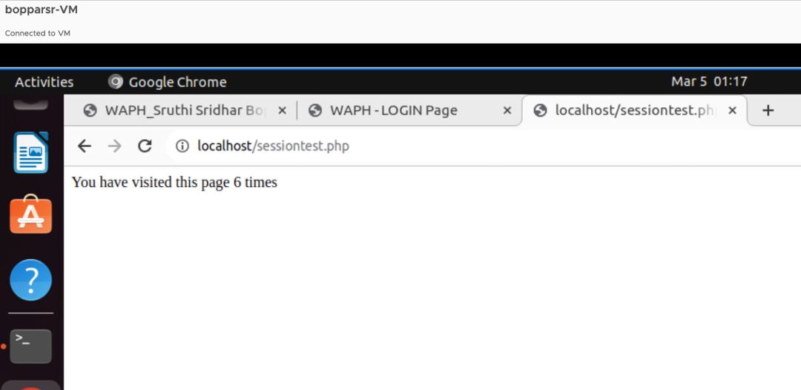

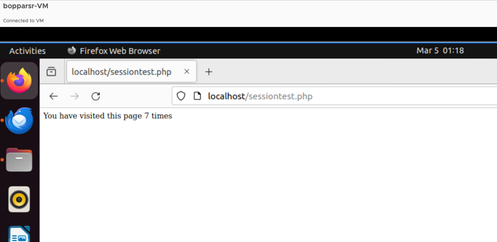

### b) Observe the Session-Handshaking using Wireshark

To perform the Wireshark sub-task, we began by downloading and installing Wireshark from the official website. After opening the application, we selected the network interface connecting our computer to the internet and initiated packet capturing. Prior to accessing sessiontest.php, we ensured the browser's cookies were cleared to maintain a clean session. Upon accessing the page, we stopped the packet capture in Wireshark. To isolate relevant packets, we applied a display filter focusing on HTTP requests and responses related to sessiontest.php. By analyzing these packets, we gained insights into the session handshaking process, identifying key information exchanged. We can observe how cookies were set and maintained.

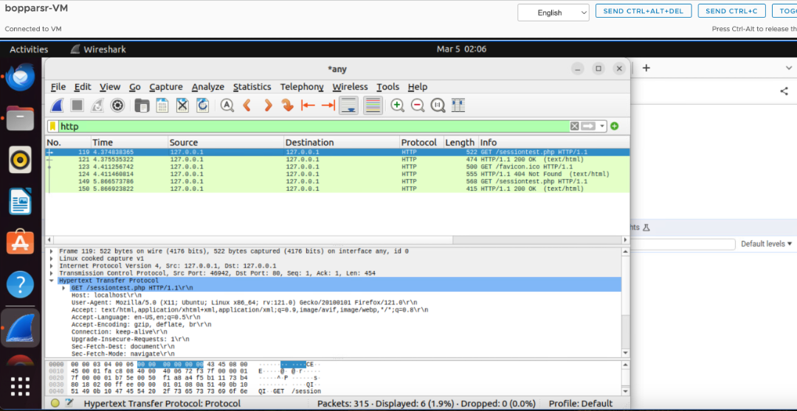

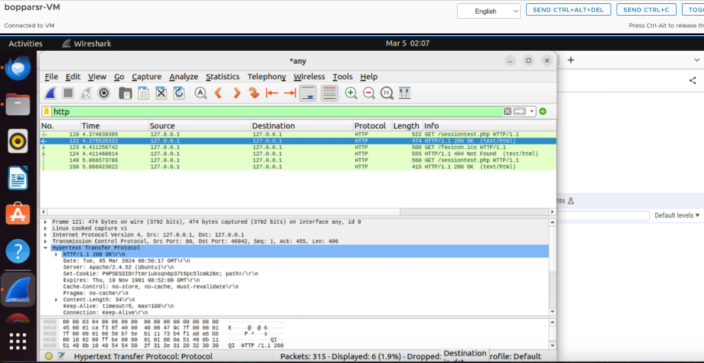

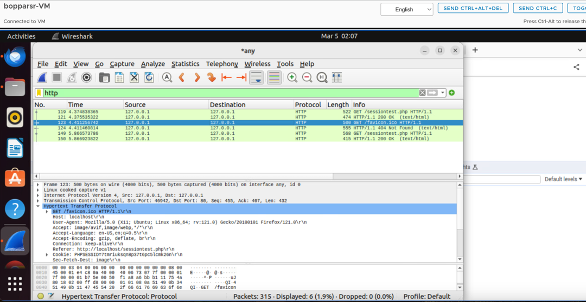

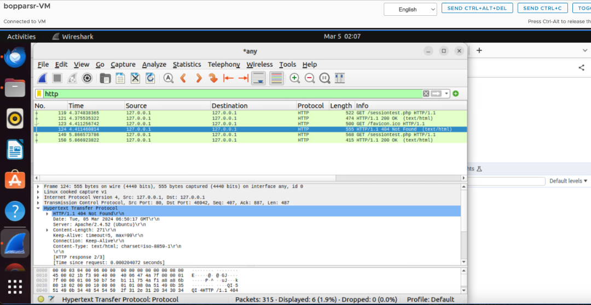

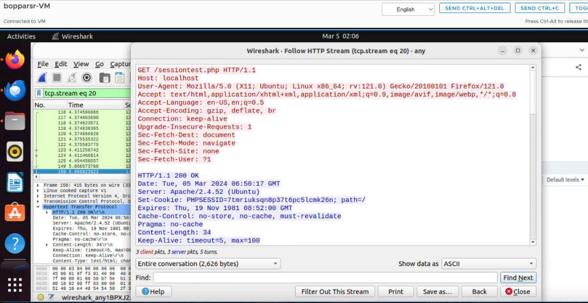

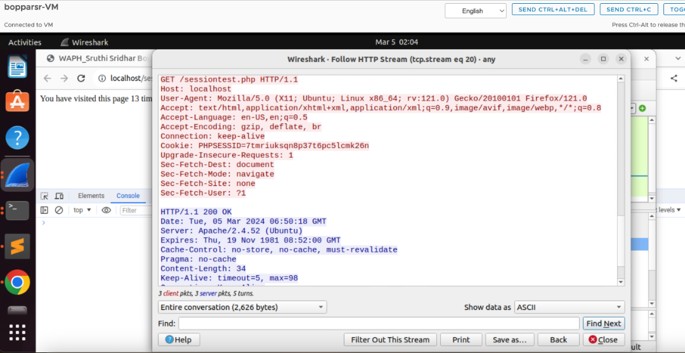

### c) Understanding Session Hijacking

Performing a session hijacking attack involves exploiting vulnerabilities in the session management of a web application. In this case, following the steps outlined in the lecture, we simulated a session hijacking attack on sessiontest.php. We intercepted the session cookie of a legitimate user by capturing session cookies and replicate session cookies. Once the session cookie was obtained, we used it to impersonate the legitimate user by injecting the captured session ID into another browser. By accessing sessiontest.php with the hijacked session, we demonstrated unauthorized access to the user's session, showcasing the potential risks associated with session hijacking.

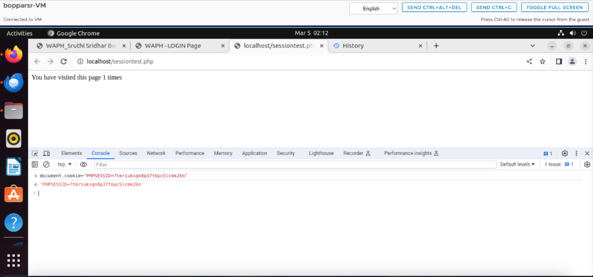

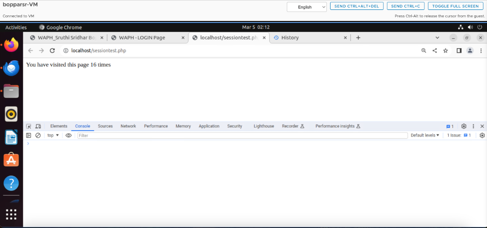

## Task 2: Insecure Session Authentication

### a) Revised Login System with Session Management

Started by copying the contents of the index.php file from the lab3 or lab4 folder in order to build session management for a login system. Create a new file named logout.php to handle logout functionality. Revise the copied index.php file to integrate session management features. Deployed both files to web server and tested the login functionality by entering valid credentials. Additionally, tested the logout functionality by accessing logout.php to ensure the session is properly destroyed.

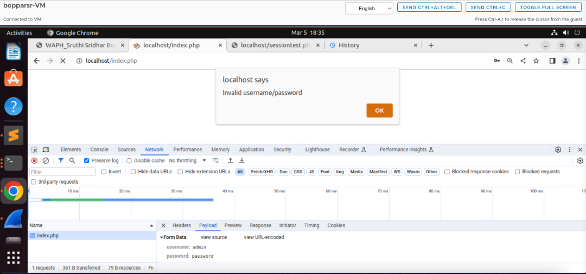

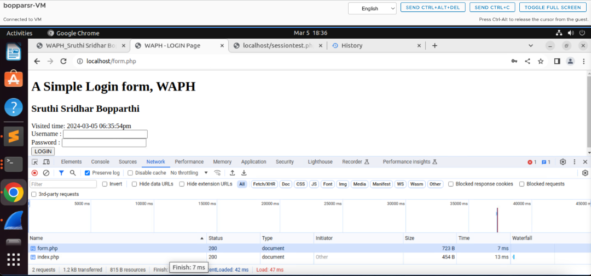

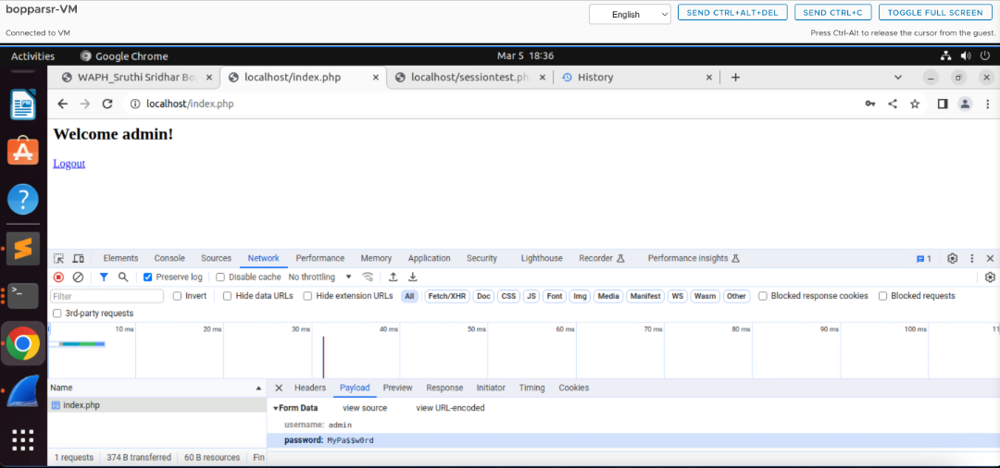

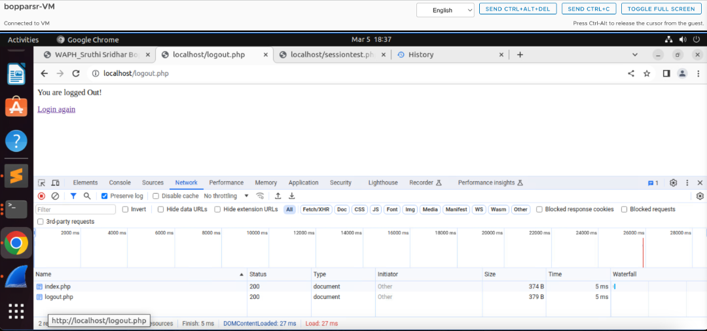

### b) Session Hijacking Attacks

In the conducted session hijacking simulation, I logged in to the web application on one browser, manually copied the session ID, and pasted it into another browser. The process was documented with screenshots, illustrating the steps involved in the session hijacking attack. This practical exercise highlighted the significance of incorporating security controls in web applications and gave a realistic grasp of the possible security issues related to session management.

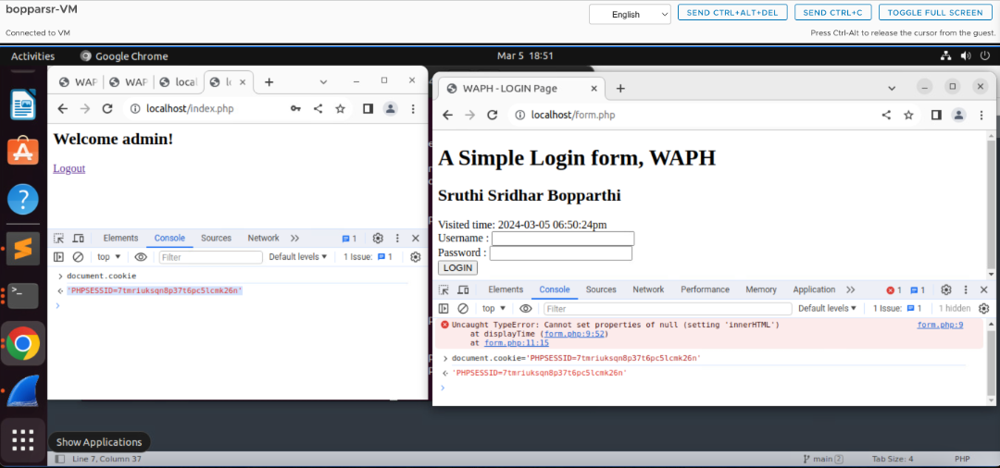

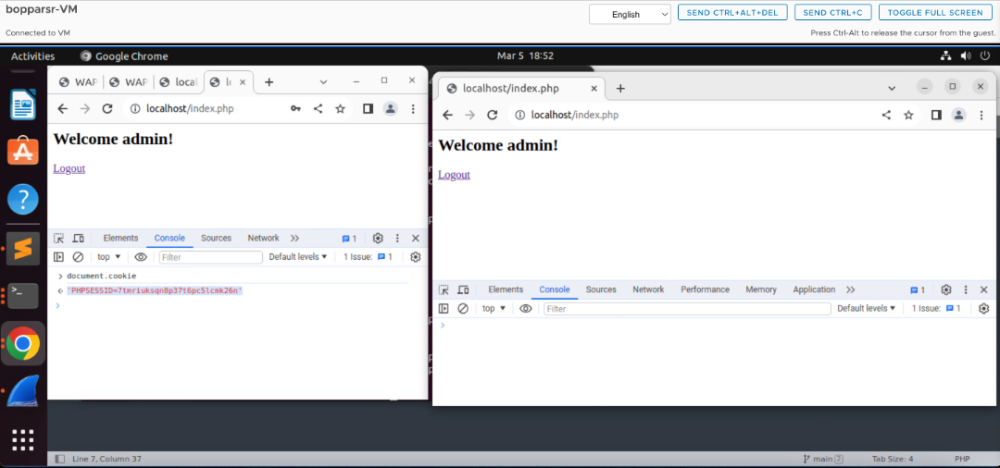

## Task 3: Securing Session and Session Authentication

### a) Data Protection and HTTPS Setup

I created an SSL certificate, installed HTTPS on my web server, and used HTTPS to view a PHP website. The screenshots display the SSL certificate's details, allowing a safe link to be established between the client and the server. By encrypting the data transferred between the user's browser and the web server, this ensures data privacy. The online application's security will increase with an efficient HTTPS implementation.

Code:
```
openssl req -x509 -nodes -days 365 -newkey rsa:4096 -keyout waph.key -out waph.crt
```

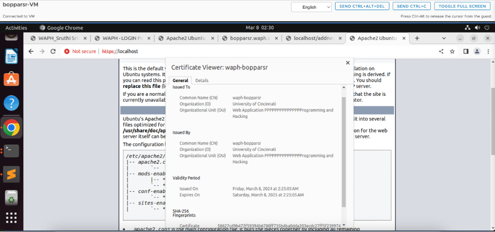

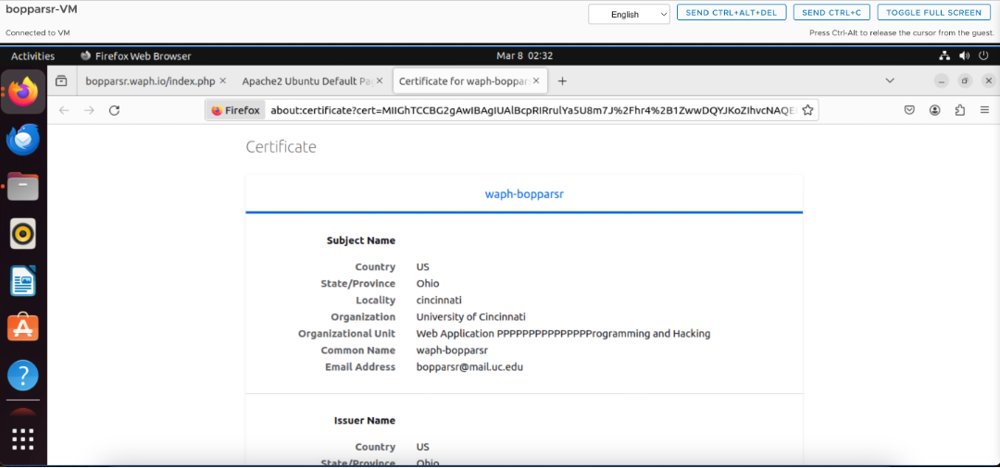

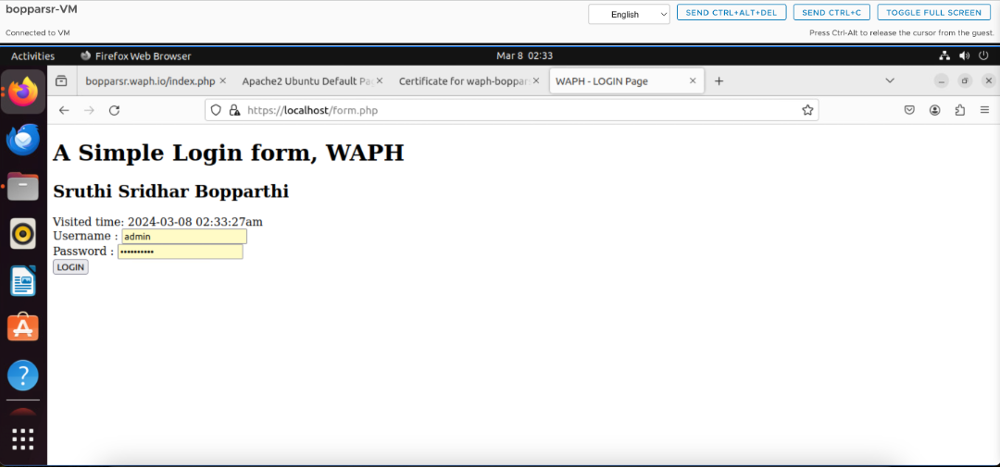

### b) Securing Session Against Session Hijacking Attacks - setting HttpOnly and Secure flags for cookies

We took important steps, such as setting the HttpOnly and Secure flags for session cookies, to strengthen the security of our sessions. By making ensuring that session cookies are designated as HttpOnly, this step reduces the possibility of cross-site scripting (XSS) threats by prohibiting client-side scripts from accessing them. Additionally, the Secure flag was applied to indicate that the cookies should only be transmitted over secure, encrypted connections, providing an extra layer of protection against unauthorized interception. 

Code:

```
<?php
        $lifetime = 15 * 60;
        $path = "/";
        $domain = "bopparsr.waph.io";
        $secure = TRUE;
        $httponly = TRUE;
        session_set_cookie_params
($lifetime,$path,$domain,$secure,$httponly);
```

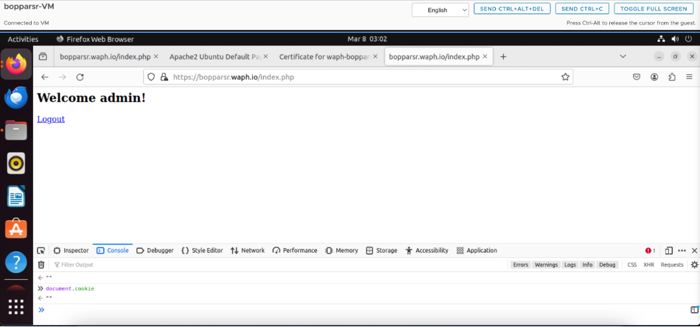

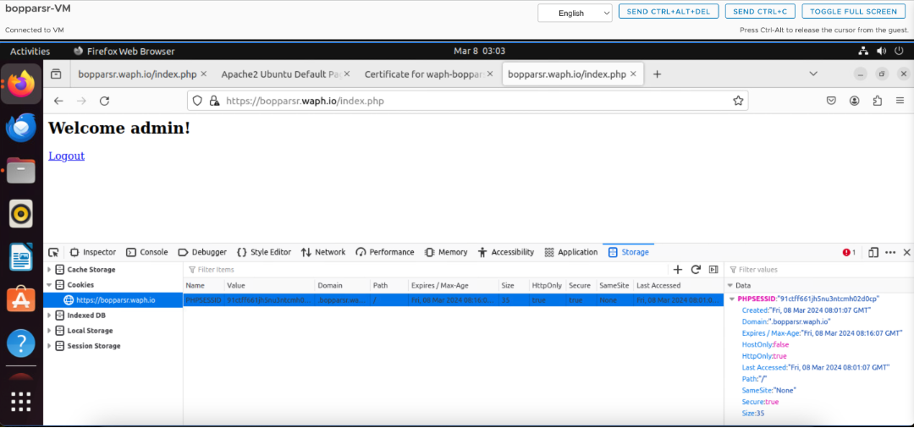

### c) Securing Session Against Session Hijacking Attacks - Defense In-Depth

I updated the index.php file to add a new session variable that keeps browser data after successful login in order to strengthen the security of our online application. Cross-referencing the data from the user's browser with the session data that has been stored is this extra line of protection. Should disparities emerge throughout this verification, suggesting a possible hijack of the session, an alarm is set off, and the user is immediately routed to the login screen. Our session management is made more proactive by this defense-in-depth approach, which enables us to quickly identify and address any questionable activity. 

Code:
```
if($_SESSION["browser"] != $_SERVER["HTTP_USER_AGENT"])
{
    session_destroy();
    echo "<script>alert('Session hijacking attack is detected!');</script>";
    header("Refresh:0; url=from.php");
    die();
}
```

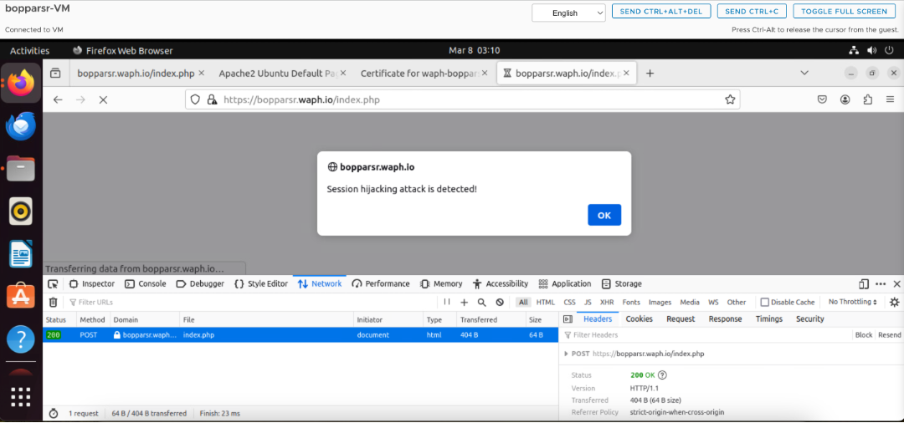
